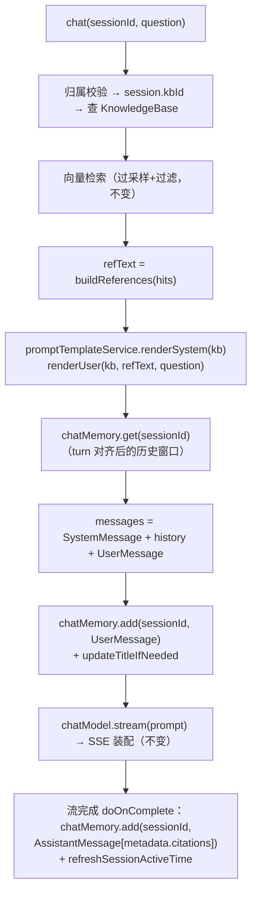

# ai-agent Prompt 工程与 ChatMemory 设计文档

> 在已落地的 ai-agent 模块（知识库 / 文档摄取 / RAG 问答 / MCP Server）之上，新增两个能力模块：
> **① Prompt 工程**（提示词模板管理 + KB 绑定 + 变量渲染）、**② ChatMemory**（对话记忆，对齐 Spring AI 抽象）。

---

## 0. 进度与上下文（新会话交接区）

### 0.1 已确认决策（用户已拍板，勿重复询问）

| #   | 决策                                         | 说明                                                                                                                                                                                        |
| --- | -------------------------------------------- | ------------------------------------------------------------------------------------------------------------------------------------------------------------------------------------------- |
| 1   | ChatMemory 采用方案 C                        | 自定义 `ChatMemory` 实现直读直写 `chat_message` 表，单一数据源，不引入官方 JDBC Repository（避免双份存储），不直接用 `MessageWindowChatMemory`（其 saveAll 全量覆盖会破坏 source of truth） |
| 2   | Prompt 工程 = 模板 CRUD + 内置变量 + KB 绑定 | 不做版本管理 / 调试试运行 / 自定义变量（MVP 边界外）                                                                                                                                        |
| 3   | 前端包含在本次 MVP                           | 新增模板管理页 + KB 编辑弹窗绑定下拉                                                                                                                                                        |
| 4   | 向后兼容                                     | 未绑定模板的 KB 渲染结果与现有硬编码行为 100% 等价                                                                                                                                          |
| 5   | 渲染引擎自研字面替换                         | 不用 Spring AI `PromptTemplate`（ST 引擎的 `{}` 语法与模板中字面 JSON 大括号冲突），用 `String.replace` 白名单替换；**按 key 长度降序**，避免 `{references}` 误伤 `{referencesBlock}`       |

### 0.2 关键技术验证结论（已从本地 jar 反编译查证，Spring AI 2.0.0 / MyBatis-Flex 1.10.3）

| #   | 验证项                         | 结论                                                                                                                                                                       |
| --- | ------------------------------ | -------------------------------------------------------------------------------------------------------------------------------------------------------------------------- |
| 1   | `ChatMemory` 接口              | `default void add(String, Message)` + `abstract void add(String, List<Message>)` + `List<Message> get(String)` + `void clear(String)`；常量 `ChatMemory.CONVERSATION_ID`   |
| 2   | `ChatMemoryRepository.saveAll` | **全量覆盖语义**（官方 `MessageWindowChatMemory` 淘汰后全量回写）→ 不可适配 `chat_message`（会删历史、丢 citations）                                                       |
| 3   | `ChatMemoryAutoConfiguration`  | `chatMemory` Bean 带 `@ConditionalOnMissingBean` → 自定义 `@Component` 实现**可安全覆盖**自动配置                                                                          |
| 4   | `AssistantMessage.Builder`     | `.content(String).properties(Map).build()`；字节码确认 `properties` 即传入 metadata 构造器，读回用 `getMetadata()` ✅（注意：metadata 构造器是 protected，必须走 Builder） |
| 5   | `UpdateEntity.of(Class)`       | MyBatis-Flex 官方"强制置空更新"：**只更新调用过 setter 的字段**（含 null），未 set 的字段不受影响 → 解绑（置 `prompt_template_id = NULL`）安全                             |
| 6   | `AgentProperties`              | yml 中无 `system-prompt` 配置，删除该字段无迁移负担                                                                                                                        |
| 7   | `ErrorCode.PARAMS_ERROR`       | 存在（40000），用于未知变量校验报错                                                                                                                                        |
| 8   | 前端                           | naive-ui；侧边栏菜单硬编码在 `AppSider.vue`；AI 路由集中在 `router/ai.ts`；已有组件按域分子目录（`components/kb/`、`components/chat/`）                                    |
| 9   | Mapper 扫描                    | `MyBatisFlexConfig` 已 `@MapperScan("com.ai.aijava.agent.mapper")`，新增 Mapper 仍须加 `@Mapper` 与现有 5 个 Mapper 保持一致                                               |
| 10  | 官方 ChatMemory vs History     | Spring AI 2.0 文档明确：`ChatMemory` 管模型上下文窗口，完整会话记录应另存；方案 C 用同一张 `chat_message` 表、两条读路径，符合该理念                                         |

### 0.3 下一步（新会话从这里继续）

1. 用户按第 8 章代码手动输入项目（spec-workflow：代码不直接写项目源码）
2. 编译验证：`mvn clean compile` + 前端 `npm run type-check`
3. 手动验收：按第 9 章清单逐项验证
4. 编译报错时直接修改项目文件修复（spec-workflow 约定的例外）

### 0.4 文档审查修订（2026-09-13，仅改文档、未改项目代码）

对照现有 ai-agent 源码、`docs/sql/ai_java.sql`、Spring AI 2.0 ChatMemory 官方文档后，已修正下列问题（第 8 章代码以本节为准）：

| 级别     | 问题                                                                                         | 修订                                                                 |
| -------- | -------------------------------------------------------------------------------------------- | -------------------------------------------------------------------- |
| Critical | `{references}` 是 `{referencesBlock}` 的前缀，`String.replace` 若先替换短 key 会截断长变量     | `render()` 按 key 长度**降序**替换                                   |
| Critical | `ai_java.sql` 若既改 CREATE 又在末尾 ALTER 同列，新库整文件重放会失败                         | CREATE 含新列；ALTER **只在存量库手工执行**，禁止写入 `ai_java.sql` |
| Critical | `PromptTemplateMapper` 缺少 `@Mapper`，与现有 Mapper 不一致                                   | 补 `@Mapper`                                                         |
| Important | `KnowledgeBaseView.vue` 整文件替换后约 230 行，超过 Vue 200 行限制                          | 抽出 `components/kb/KbFormModal.vue`，列表页只保留卡片与删除         |
| Important | 编辑弹窗放在 `src/components/PromptEditModal.vue`，与现有 `components/{domain}/` 不一致     | 改为 `src/components/prompt/PromptEditModal.vue`                     |
| Important | `KnowledgeBaseService.update` 名称更新与绑定更新分两次、无事务                               | `@Transactional` 包裹                                                |
| Important | 模板删除按 `prompt_template_id` 批量解绑，缺索引                                             | `knowledge_base` 增加 `idx_prompt_template_id`                       |
| Minor    | 弹窗 `handleSave` 失败时 catch 未 `return false`，NModal 仍会关闭                             | catch 中 `return false`                                              |
| Minor    | 文档乱码（「无结果空串」「查最近」等处 UTF-8 损坏）                                          | 已修复                                                               |

---

## 1. 需求概要与 MVP 边界

### 1.1 现状痛点

| 痛点                                                        | 现状代码位置                                                     |
| ----------------------------------------------------------- | ---------------------------------------------------------------- |
| 系统提示词全局唯一，所有 KB 共用                            | `AgentProperties.systemPrompt`（yml 配置）                       |
| 用户消息格式硬编码（`"参考资料：\n...\n\n问题：..."`）      | `RagChatService.doChat` L100                                     |
| 历史加载手写，未对齐 Spring AI 抽象                         | `ChatSessionService.getHistory`（手动查表 + 剥离 dangling user） |
| 消息读写散落两处（RagChatService 拼 Prompt 时读、落库时写） | `RagChatService` + `ChatSessionService`                          |

### 1.2 两个模块的目标

**Prompt 工程**：提示词模板进数据库，用户可创建/编辑/删除模板；模板支持 5 个内置变量；每个知识库可绑定一个模板；聊天时按 KB 取模板渲染 SystemMessage 与 UserMessage。

**ChatMemory**：实现 Spring AI `ChatMemory` 接口直读直写 `chat_message` 表，收编现有手写 history 逻辑并增强 turn 边界对齐；RagChatService 通过 `chatMemory.get/add/clear` 操作对话记忆。

### 1.3 MVP 边界（不做）

- ❌ 模板版本管理、A/B 测试、调试试运行
- ❌ 摘要记忆 / token 窗口记忆 / 跨会话长期记忆
- ❌ 用户自定义变量名（仅 5 个内置白名单变量）
- ❌ ChatClient + MessageChatMemoryAdvisor 改造（继续用 `ChatModel.stream`，`/chat` 接口协议不变）
- ❌ 模板分享 / 公共模板市场（模板私有，按 user_id 隔离）

---

## 2. 方案选型记录

### 2.1 ChatMemory 三方案对比（已选 C）

| 方案                                                       | 说明                                                   | 结论                                                                                        |
| ---------------------------------------------------------- | ------------------------------------------------------ | ------------------------------------------------------------------------------------------- |
| A. 官方 `JdbcChatMemoryRepository` starter                 | 自动建 `SPRING_AI_CHAT_MEMORY` 表                      | ❌ 双份存储：与 `chat_message`（含 citations，source of truth）重复，双写不一致风险         |
| B. `MessageWindowChatMemory` + 自定义 Repository           | 复用官方窗口实现                                       | ❌ saveAll 全量覆盖语义：窗口外消息被删、重插丢 citations，破坏 source of truth             |
| **C. 自定义 `DbChatMemory implements ChatMemory`（选定）** | add=追加插入 / get=读窗口+turn对齐 / clear=按session删 | ✅ 单一数据源、零双写、收编现有逻辑、对齐 Spring AI 抽象（未来可无痛接 ChatClient Advisor） |

**chat memory vs chat history 的关系**（Spring AI 官方理念）：`chat_message` 表同时承担两者——

- **chat history**（完整历史，前端展示）：`ChatSessionService.listMessages` 读全量，不动
- **chat memory**（模型上下文窗口）：`DbChatMemory.get` 读最近 N 条 + turn 对齐，只增不删

### 2.2 渲染引擎选型（自研字面替换）

| 选项                                                  | 问题                                                                                                 |
| ----------------------------------------------------- | ---------------------------------------------------------------------------------------------------- |
| Spring AI `PromptTemplate`（ST 引擎）                 | ST 的 `{expr}` 语法与模板正文中字面 `{`/`}`（如 JSON 输出格式示例）冲突，解析直接报错且无友好转义    |
| Hutool `StrUtil.format`                               | `{}` 占位符同样有转义负担                                                                            |
| **`String.replace("{var}", value)` 字面替换（选定）** | 变量是封闭白名单（5 个），无表达式需求；模板正文任意字符安全；渲染是纯替换、永不抛异常。**必须按 key 长度降序替换**：`{references}` 是 `{referencesBlock}` 的前缀，先替换短 key 会把 `{referencesBlock}` 变成 `{<refs值>Block}` |

### 2.3 变量白名单

| 变量                | 用于            | 渲染值                                                                                        |
| ------------------- | --------------- | --------------------------------------------------------------------------------------------- |
| `{kbName}`          | system_template | 知识库名称                                                                                    |
| `{kbDescription}`   | system_template | 知识库描述（空串兜底）                                                                        |
| `{question}`        | user_template   | 用户本次提问原文                                                                              |
| `{references}`      | user_template   | 检索到的参考资料纯文本（无结果时空串）                                                        |
| `{referencesBlock}` | user_template   | 无结果时空串；有结果时 `参考资料：\n{refs}\n\n`（自动带标题与尾部空行，与现有格式逐字节等价） |

**默认模板**（未绑定时使用，渲染结果与改造前硬编码 100% 等价）：

- system：`你是知识库问答助手，仅依据参考资料回答问题；回答末尾不需要提及参考资料本身；当参考资料未覆盖提问内容时，明确说明未在知识库中找到直接依据。`（原 `DEFAULT_SYSTEM_PROMPT` 原文迁移）
- user：`{referencesBlock}问题：{question}`

---

## 3. 数据库设计

### 3.1 表关系

```
user ──1:N── prompt_template
                 │ 1
                 │ （弱引用，prompt_template_id 可 NULL = 默认模板）
                 ▼ N
            knowledge_base
```

- 绑定校验同用户（绑定/渲染时校验 `template.userId == kb.userId`）
- 删除模板 → 批量解绑引用它的 KB（`prompt_template_id` 置 NULL），**不级联删 KB**
- `knowledge_base.prompt_template_id` 建普通索引（删除模板时按该列 `updateByQuery`，避免全表扫描）

### 3.2 DDL

```sql
-- 提示词模板表
CREATE TABLE `prompt_template` (
    `id`              BIGINT       NOT NULL AUTO_INCREMENT COMMENT '模板ID',
    `user_id`         BIGINT       NOT NULL COMMENT '所属用户ID',
    `name`            VARCHAR(64)  NOT NULL COMMENT '模板名称',
    `description`     VARCHAR(256) DEFAULT '' COMMENT '模板描述',
    `system_template` TEXT         NOT NULL COMMENT '系统提示词模板（变量 {kbName} {kbDescription}）',
    `user_template`   TEXT         NOT NULL COMMENT '用户消息模板（变量 {question} {references} {referencesBlock}）',
    `create_time`     DATETIME     NOT NULL DEFAULT CURRENT_TIMESTAMP COMMENT '创建时间',
    `update_time`     DATETIME     NOT NULL DEFAULT CURRENT_TIMESTAMP ON UPDATE CURRENT_TIMESTAMP COMMENT '更新时间',
    PRIMARY KEY (`id`),
    INDEX `idx_user_id` (`user_id`)
) ENGINE=InnoDB DEFAULT CHARSET=utf8mb4 COMMENT='提示词模板表';

-- 新库：改 knowledge_base 建表语句（见 8.1 改动 1），含 prompt_template_id 列 + idx_prompt_template_id
-- 存量库：下面两句只在已运行的库手工执行，禁止写入 ai_java.sql 可执行流
--   （新库 CREATE 已含该列，整文件重放再 ALTER 会 Duplicate column）
-- ALTER TABLE `knowledge_base`
--     ADD COLUMN `prompt_template_id` BIGINT DEFAULT NULL COMMENT '绑定的提示词模板ID（NULL=默认模板）' AFTER `description`;
-- ALTER TABLE `knowledge_base`
--     ADD INDEX `idx_prompt_template_id` (`prompt_template_id`);
```

存量库补丁（独立执行，见实施计划 Task 1 Step 3）：

```sql
ALTER TABLE `knowledge_base`
    ADD COLUMN `prompt_template_id` BIGINT DEFAULT NULL COMMENT '绑定的提示词模板ID（NULL=默认模板）' AFTER `description`;
ALTER TABLE `knowledge_base`
    ADD INDEX `idx_prompt_template_id` (`prompt_template_id`);
```

### 3.3 关键设计决策

1. **`prompt_template_id` 弱引用、可 NULL**：不建外键约束；NULL = 使用内置默认模板（存量 KB 全部 NULL，行为不变）。
2. **解绑靠 `UpdateEntity` 置空**：MyBatis-Flex 常规 `update(entity)` 忽略 null 字段，置空必须走 `UpdateEntity.of(Class)`（只更新调用过 setter 的字段，含 null）。
3. **无版本表**：MVP 模板直接覆盖更新，`update_time` 记录最后修改。
4. **`chat_message` 表零变更**：citations 列已存在，assistant 消息的 citations 通过 `AssistantMessage.metadata` 传递后落库。
5. **DDL 双路径**：新库只改 `knowledge_base` 的 CREATE TABLE；存量库只跑 ALTER。两者不可写进同一份可执行 SQL。

---

## 4. 核心组件设计

### 4.1 模块结构（增量）

```
ai-agent/src/main/java/com/ai/aijava/agent/
├── config/
│   └── AgentProperties.java          [改] 删 systemPrompt 相关，保留 topK/historyRounds
├── controller/
│   └── PromptTemplateController.java [新] /prompt CRUD
├── dto/
│   ├── request/
│   │   ├── PromptTemplateCreateRequest.java   [新]
│   │   ├── PromptTemplateUpdateRequest.java   [新]
│   │   └── KnowledgeBaseUpdateRequest.java    [改] + promptTemplateId
│   └── vo/
│       ├── PromptTemplateVO.java              [新]
│       └── KnowledgeBaseVO.java               [改] + promptTemplateId
├── entity/
│   ├── PromptTemplate.java           [新]
│   └── KnowledgeBase.java            [改] + promptTemplateId
├── mapper/
│   └── PromptTemplateMapper.java     [新] 须加 @Mapper（与现有 Mapper 一致）
├── memory/
│   └── DbChatMemory.java             [新] ChatMemory 实现（@Component 覆盖自动配置）
└── service/
    ├── PromptTemplateService.java    [新] CRUD + 渲染 + 变量校验 + 删除时解绑
    ├── RagChatService.java           [改] 模板渲染 + chatMemory 集成
    ├── ChatSessionService.java       [改] 删 getHistory/save*Message（收编进 DbChatMemory）
    └── KnowledgeBaseService.java     [改] update 支持绑定/解绑（@Transactional）
```

### 4.2 PromptTemplateService（渲染核心）

```
create(request)   → 校验变量白名单 → insert
list()            → 当前用户模板
update(request)   → 归属校验 → 变量校验 → update
delete(id)        → 归属校验 → 解绑引用 KB（UpdateEntity 置空）→ delete

renderSystem(kb)  → kb.promptTemplateId 取模板（NULL/已删/归属不符 → 默认）
                    → 按 key 长度降序替换 {kbName} {kbDescription}
renderUser(kb, references, question)
                  → 同上取模板 → 计算 referencesBlock
                  → 按 key 长度降序替换（referencesBlock 先于 references）

validateVars(template, allowed)
                  → 正则提取 {xxx} 与白名单比对，未知变量抛 PARAMS_ERROR（创建/更新时拦截，防拼错占位符静默生效）
```

### 4.3 DbChatMemory（ChatMemory 实现）

```
conversationId = String.valueOf(sessionId)   ← 全项目唯一约定

add(convId, List<Message>)   → 逐条追加插入 chat_message
                               （仅处理 UserMessage/AssistantMessage；
                                 citations 从 message.metadata["citations"] 取出落列）
get(convId)                  → 查最近 historyRounds*2 条（倒序 limit → reverse 升序）
                               → 头部剥离连续 assistant（窗口截断的不完整 turn；对齐 Spring AI 2.0
                                  MessageWindowChatMemory 的 turn-boundary：窗口必须以完整 user 轮次开头）
                               → 尾部剥离连续 user（流式失败遗留，原 getHistory 逻辑）
clear(convId)                → 按 sessionId 删除全部消息（deleteSession 复用）
```

`@Component` 注册即可覆盖自动配置（已验证 `@ConditionalOnMissingBean`）。

### 4.4 RagChatService 改造后的问答链路



### 4.5 时序与行为兼容性

| 环节                | 改造前                                        | 改造后                                    | 兼容性        |
| ------------------- | --------------------------------------------- | ----------------------------------------- | ------------- |
| 历史                | `getHistory`（此时本轮 user 未落库）          | `chatMemory.get`（同样先读后写）          | ✅ 时序不变   |
| user 落库           | `saveUserMessage`                             | `chatMemory.add`                          | ✅ 同表同字段 |
| assistant 落库      | `saveAssistantMessage(answer, citationsJson)` | `chatMemory.add`（citations 走 metadata） | ✅ 同表同字段 |
| 未绑定 KB 的 Prompt | 硬编码拼接                                    | 默认模板渲染                              | ✅ 逐字节等价 |
| 删除会话            | `deleteByQuery`                               | `chatMemory.clear`                        | ✅ 同 SQL     |
| SSE 事件协议        | message/citations/end/error                   | 不变                                      | ✅ 前端零改动 |

---

## 5. API 接口定义

### 5.1 提示词模板（PromptTemplateController，`/prompt`）

| 方法   | 路径             | 功能                    | 鉴权            | 审计                     |
| ------ | ---------------- | ----------------------- | --------------- | ------------------------ |
| POST   | `/prompt/create` | 创建模板                | `@RequireLogin` | `@AuditLog(DATA_CREATE)` |
| GET    | `/prompt/list`   | 我的模板列表            | `@RequireLogin` | —                        |
| POST   | `/prompt/update` | 修改模板                | `@RequireLogin` | `@AuditLog(DATA_UPDATE)` |
| DELETE | `/prompt/{id}`   | 删除模板（自动解绑 KB） | `@RequireLogin` | `@AuditLog(DATA_DELETE)` |

### 5.2 知识库接口变更（复用现有 `/kb/update`）

`KnowledgeBaseUpdateRequest` 新增可选字段 `promptTemplateId`，语义：

| 取值           | 行为                                               |
| -------------- | -------------------------------------------------- |
| `null`（不传） | 不修改绑定（旧客户端兼容）                         |
| `0`            | 解绑（`prompt_template_id` 置 NULL，回到默认模板） |
| `> 0`          | 绑定（校验模板归属当前用户后写入）                 |
| `< 0`          | 非法，抛 `PARAMS_ERROR`                            |

实现上 `update()` 整体 `@Transactional`；绑定字段单独走 `UpdateEntity`（name/description 仍走常规 update）。

---

## 6. 前端设计

### 6.1 文件清单

| 文件                                     | 类型 | 说明                                                                  |
| ---------------------------------------- | ---- | --------------------------------------------------------------------- |
| `src/api/prompt.ts`                      | 新增 | 4 个 API 封装                                                         |
| `src/views/ai/PromptTemplateView.vue`    | 新增 | 模板列表卡片（≤200 行）                                               |
| `src/components/prompt/PromptEditModal.vue` | 新增 | 新增/编辑弹窗（与 `components/kb/`、`components/chat/` 同样按域分目录） |
| `src/components/kb/KbFormModal.vue`      | 新增 | KB 新建/编辑弹窗（含模板下拉；抽出后列表页不超 200 行）               |
| `src/types/ai.ts`                        | 修改 | + PromptTemplate 类型；KnowledgeBase/UpdateKbRequest 加字段           |
| `src/router/ai.ts`                       | 修改 | + `/prompt` 路由（menu: "prompt"）                                    |
| `src/layouts/AppSider.vue`               | 修改 | + 菜单项"提示词模板"（DocumentTextOutline 图标）                      |
| `src/views/ai/KnowledgeBaseView.vue`     | 修改 | 列表 + 删除；弹窗委托 `KbFormModal`                                   |

### 6.2 关键交互

- **模板编辑器**：system/user 两个 textarea，Modal 内固定展示变量说明文案（可用变量 + `{referencesBlock}` 空结果行为提示）
- **KB 绑定**：仅编辑弹窗显示下拉，选项 = `默认模板（value=0）` + 我的模板列表（value=id）；保存时随 `updateKbApi` 提交 `promptTemplateId`（前端 `?? 0` 回显，提交原样传 0，由后端三态消化）
- **创建 KB**：不显示模板下拉（建库后默认 NULL = 默认模板，编辑时再绑）
- **弹窗失败不关闭**：`handleSave` 的 catch 必须 `return false`，否则 NModal 的 `on-positive-click` 在 Promise resolve 后仍会关闭弹窗

---

## 7. 配置变更

`application-prod.yml` **无变更**（`agent.*` 现有键全部保留）。

`AgentProperties` 删除 `systemPrompt` 字段、`DEFAULT_SYSTEM_PROMPT` 常量、`effectiveSystemPrompt()` 方法（由 `PromptTemplateService` 的默认模板替代）。保留：`uploadDir`、`allowedTypes`、`maxFileSize`、`chunkSize`、`topK`、`historyRounds`。

---

## 8. 完整实现代码

> 按 spec-workflow：代码先写入本文档，用户手动输入项目；每个文件完整 package + import + 类定义。

### 8.1 SQL（`docs/sql/ai_java.sql` 只含新库路径；存量库 ALTER 见改动 3）

**改动 1**：`knowledge_base` 建表语句两处（新库直接生效）——`description` 行后加列；主键后加索引：

```sql
-- 文件路径：docs/sql/ai_java.sql（knowledge_base 建表语句内）
    `description` VARCHAR(256) DEFAULT '' COMMENT '知识库描述',
    `prompt_template_id` BIGINT DEFAULT NULL COMMENT '绑定的提示词模板ID（NULL=默认模板）',
    `user_id`     BIGINT       NOT NULL COMMENT '创建者用户ID',
```

```sql
-- 同一 CREATE TABLE 的索引区，idx_user_id 后追加
    PRIMARY KEY (`id`),
    INDEX `idx_user_id` (`user_id`),
    INDEX `idx_prompt_template_id` (`prompt_template_id`)
```

**改动 2**：文件末尾**只追加** `prompt_template` 建表（不要把 ALTER 写进来）：

```sql
-- ==================== Prompt 工程 ====================

-- 提示词模板表
CREATE TABLE `prompt_template` (
    `id`              BIGINT       NOT NULL AUTO_INCREMENT COMMENT '模板ID',
    `user_id`         BIGINT       NOT NULL COMMENT '所属用户ID',
    `name`            VARCHAR(64)  NOT NULL COMMENT '模板名称',
    `description`     VARCHAR(256) DEFAULT '' COMMENT '模板描述',
    `system_template` TEXT         NOT NULL COMMENT '系统提示词模板（变量 {kbName} {kbDescription}）',
    `user_template`   TEXT         NOT NULL COMMENT '用户消息模板（变量 {question} {references} {referencesBlock}）',
    `create_time`     DATETIME     NOT NULL DEFAULT CURRENT_TIMESTAMP COMMENT '创建时间',
    `update_time`     DATETIME     NOT NULL DEFAULT CURRENT_TIMESTAMP ON UPDATE CURRENT_TIMESTAMP COMMENT '更新时间',
    PRIMARY KEY (`id`),
    INDEX `idx_user_id` (`user_id`)
) ENGINE=InnoDB DEFAULT CHARSET=utf8mb4 COMMENT='提示词模板表';
```

**改动 3（存量库手工执行，禁止写入 `ai_java.sql`）**：已运行的 MySQL 执行下面两句。新库走改动 1，不要再跑 ALTER。

```sql
ALTER TABLE `knowledge_base`
    ADD COLUMN `prompt_template_id` BIGINT DEFAULT NULL COMMENT '绑定的提示词模板ID（NULL=默认模板）' AFTER `description`;
ALTER TABLE `knowledge_base`
    ADD INDEX `idx_prompt_template_id` (`prompt_template_id`);
```

### 8.2 后端新增文件

**文件路径：`ai-agent/src/main/java/com/ai/aijava/agent/entity/PromptTemplate.java`**

```java
package com.ai.aijava.agent.entity;

import com.mybatisflex.annotation.Id;
import com.mybatisflex.annotation.KeyType;
import com.mybatisflex.annotation.Table;
import lombok.AllArgsConstructor;
import lombok.Builder;
import lombok.Data;
import lombok.NoArgsConstructor;

import java.time.LocalDateTime;

/**
 * 提示词模板实体，对应 prompt_template 表
 */
@Data
@Builder
@NoArgsConstructor
@AllArgsConstructor
@Table("prompt_template")
public class PromptTemplate {

    /** 模板 ID（主键，自增） */
    @Id(keyType = KeyType.Auto)
    private Long id;

    /** 所属用户 ID */
    private Long userId;

    /** 模板名称 */
    private String name;

    /** 模板描述 */
    private String description;

    /** 系统提示词模板（变量 {kbName} {kbDescription}） */
    private String systemTemplate;

    /** 用户消息模板（变量 {question} {references} {referencesBlock}） */
    private String userTemplate;

    /** 创建时间 */
    private LocalDateTime createTime;

    /** 更新时间 */
    private LocalDateTime updateTime;
}
```

**文件路径：`ai-agent/src/main/java/com/ai/aijava/agent/mapper/PromptTemplateMapper.java`**

```java
package com.ai.aijava.agent.mapper;

import com.ai.aijava.agent.entity.PromptTemplate;
import com.mybatisflex.core.BaseMapper;
import org.apache.ibatis.annotations.Mapper;

/**
 * 提示词模板 Mapper
 */
@Mapper
public interface PromptTemplateMapper extends BaseMapper<PromptTemplate> {
}
```

**文件路径：`ai-agent/src/main/java/com/ai/aijava/agent/dto/request/PromptTemplateCreateRequest.java`**

```java
package com.ai.aijava.agent.dto.request;

import jakarta.validation.constraints.NotBlank;
import jakarta.validation.constraints.Size;
import lombok.Data;

/**
 * 创建提示词模板请求
 */
@Data
public class PromptTemplateCreateRequest {

    @NotBlank(message = "模板名称不能为空")
    @Size(max = 64, message = "模板名称最长 64 字符")
    private String name;

    @Size(max = 256, message = "描述最长 256 字符")
    private String description;

    @NotBlank(message = "系统提示词模板不能为空")
    @Size(max = 4000, message = "系统提示词模板最长 4000 字符")
    private String systemTemplate;

    @NotBlank(message = "用户消息模板不能为空")
    @Size(max = 2000, message = "用户消息模板最长 2000 字符")
    private String userTemplate;
}
```

**文件路径：`ai-agent/src/main/java/com/ai/aijava/agent/dto/request/PromptTemplateUpdateRequest.java`**

```java
package com.ai.aijava.agent.dto.request;

import jakarta.validation.constraints.NotBlank;
import jakarta.validation.constraints.NotNull;
import jakarta.validation.constraints.Size;
import lombok.Data;

/**
 * 修改提示词模板请求
 */
@Data
public class PromptTemplateUpdateRequest {

    @NotNull(message = "模板 ID 不能为空")
    private Long id;

    @NotBlank(message = "模板名称不能为空")
    @Size(max = 64, message = "模板名称最长 64 字符")
    private String name;

    @Size(max = 256, message = "描述最长 256 字符")
    private String description;

    @NotBlank(message = "系统提示词模板不能为空")
    @Size(max = 4000, message = "系统提示词模板最长 4000 字符")
    private String systemTemplate;

    @NotBlank(message = "用户消息模板不能为空")
    @Size(max = 2000, message = "用户消息模板最长 2000 字符")
    private String userTemplate;
}
```

**文件路径：`ai-agent/src/main/java/com/ai/aijava/agent/dto/vo/PromptTemplateVO.java`**

```java
package com.ai.aijava.agent.dto.vo;

import com.fasterxml.jackson.annotation.JsonFormat;
import lombok.AllArgsConstructor;
import lombok.Builder;
import lombok.Data;
import lombok.NoArgsConstructor;

import java.time.LocalDateTime;

/**
 * 提示词模板视图对象
 */
@Data
@Builder
@NoArgsConstructor
@AllArgsConstructor
public class PromptTemplateVO {

    private Long id;

    private String name;

    private String description;

    private String systemTemplate;

    private String userTemplate;

    @JsonFormat(pattern = "yyyy-MM-dd HH:mm:ss")
    private LocalDateTime createTime;

    @JsonFormat(pattern = "yyyy-MM-dd HH:mm:ss")
    private LocalDateTime updateTime;
}
```

**文件路径：`ai-agent/src/main/java/com/ai/aijava/agent/memory/DbChatMemory.java`**

```java
package com.ai.aijava.agent.memory;

import com.ai.aijava.agent.config.AgentProperties;
import com.ai.aijava.agent.entity.ChatMessage;
import com.ai.aijava.agent.mapper.ChatMessageMapper;
import com.ai.aijava.exception.BusinessException;
import com.ai.aijava.exception.ErrorCode;
import com.mybatisflex.core.query.QueryWrapper;
import lombok.RequiredArgsConstructor;
import lombok.extern.slf4j.Slf4j;
import org.springframework.ai.chat.messages.AssistantMessage;
import org.springframework.ai.chat.messages.Message;
import org.springframework.ai.chat.messages.UserMessage;
import org.springframework.ai.chat.memory.ChatMemory;
import org.springframework.stereotype.Component;

import java.time.LocalDateTime;
import java.util.ArrayList;
import java.util.Collections;
import java.util.List;

/**
 * ChatMemory 实现：直读直写 chat_message 表（单一数据源，设计 2.1 方案 C）
 *
 * conversationId 全项目约定 = String.valueOf(sessionId)。
 * chat memory（模型上下文窗口，get 读窗口）与 chat history（前端展示，
 * ChatSessionService.listMessages 读全量）共用本表，互不干扰。
 *
 * 不使用官方 MessageWindowChatMemory：其 saveAll 为全量覆盖语义，
 * 会删除窗口外历史并丢失 citations，破坏 chat_message 的 source of truth 地位。
 *
 * @Component 注册后自动覆盖 Spring AI 自动配置的 ChatMemory
 * （ChatMemoryAutoConfiguration 带 @ConditionalOnMissingBean，已查证）。
 */
@Slf4j
@Component
@RequiredArgsConstructor
public class DbChatMemory implements ChatMemory {

    /** assistant 消息 metadata 中携带 citations JSON 的 key */
    public static final String CITATIONS_KEY = "citations";

    private final ChatMessageMapper chatMessageMapper;
    private final AgentProperties agentProperties;

    /**
     * 追加消息（仅 User/Assistant；单条 default 方法自动转调本方法）
     */
    @Override
    public void add(String conversationId, List<Message> messages) {
        long sessionId = parseSessionId(conversationId);
        for (Message message : messages) {
            if (message instanceof UserMessage || message instanceof AssistantMessage) {
                chatMessageMapper.insert(toEntity(sessionId, message));
            } else {
                log.warn("DbChatMemory 忽略不支持的消息类型: {}", message.getMessageType());
            }
        }
    }

    /**
     * 读取记忆窗口：最近 historyRounds*2 条 → turn 边界对齐
     * 头部剥离连续 assistant（窗口截断导致的不完整轮次），
     * 尾部剥离连续 user（流式失败遗留的无应答提问）
     */
    @Override
    public List<Message> get(String conversationId) {
        long sessionId = parseSessionId(conversationId);
        int limit = agentProperties.getHistoryRounds() * 2;
        List<ChatMessage> msgs = new ArrayList<>(chatMessageMapper.selectListByQuery(
                QueryWrapper.create()
                        .select(ChatMessage::getRole, ChatMessage::getContent)
                        .where(ChatMessage::getSessionId).eq(sessionId)
                        .orderBy(ChatMessage::getId, false)
                        .limit(limit)));
        if (msgs.isEmpty()) {
            return List.of();
        }
        Collections.reverse(msgs);
        // 头部：丢弃开头连续 assistant（不完整 turn 的尾巴）
        while (!msgs.isEmpty() && ChatMessage.ROLE_ASSISTANT.equals(msgs.getFirst().getRole())) {
            msgs.removeFirst();
        }
        // 尾部：剥离末尾连续 user（防 LLM 看到连续 user 无 assistant）
        while (!msgs.isEmpty() && ChatMessage.ROLE_USER.equals(msgs.getLast().getRole())) {
            msgs.removeLast();
        }
        return msgs.stream().<Message>map(m -> ChatMessage.ROLE_USER.equals(m.getRole())
                ? new UserMessage(m.getContent())
                : new AssistantMessage(m.getContent())).toList();
    }

    /**
     * 清空会话全部消息（ChatSessionService.deleteSession 复用）
     */
    @Override
    public void clear(String conversationId) {
        long sessionId = parseSessionId(conversationId);
        chatMessageMapper.deleteByQuery(QueryWrapper.create()
                .where(ChatMessage::getSessionId).eq(sessionId));
    }

    /**
     * Message → ChatMessage 实体（citations 从 metadata 取出落列）
     */
    private ChatMessage toEntity(long sessionId, Message message) {
        String citations = null;
        if (message.getMetadata() != null) {
            Object cite = message.getMetadata().get(CITATIONS_KEY);
            if (cite instanceof String s && !s.isBlank()) {
                citations = s;
            }
        }
        boolean isUser = message instanceof UserMessage;
        return ChatMessage.builder()
                .sessionId(sessionId)
                .role(isUser ? ChatMessage.ROLE_USER : ChatMessage.ROLE_ASSISTANT)
                .content(message.getText() == null ? "" : message.getText())
                .citations(citations)
                .createTime(LocalDateTime.now())
                .build();
    }

    /**
     * conversationId → sessionId（全项目约定 String.valueOf(sessionId)）
     */
    private long parseSessionId(String conversationId) {
        try {
            return Long.parseLong(conversationId);
        } catch (NumberFormatException e) {
            throw new BusinessException(ErrorCode.PARAMS_ERROR, "无效的会话 ID");
        }
    }
}
```

**文件路径：`ai-agent/src/main/java/com/ai/aijava/agent/service/PromptTemplateService.java`**

```java
package com.ai.aijava.agent.service;

import com.ai.aijava.agent.dto.request.PromptTemplateCreateRequest;
import com.ai.aijava.agent.dto.request.PromptTemplateUpdateRequest;
import com.ai.aijava.agent.dto.vo.PromptTemplateVO;
import com.ai.aijava.agent.entity.KnowledgeBase;
import com.ai.aijava.agent.entity.PromptTemplate;
import com.ai.aijava.agent.mapper.KnowledgeBaseMapper;
import com.ai.aijava.agent.mapper.PromptTemplateMapper;
import com.ai.aijava.context.UserContext;
import com.ai.aijava.exception.BusinessException;
import com.ai.aijava.exception.ErrorCode;
import com.mybatisflex.core.query.QueryWrapper;
import com.mybatisflex.core.util.UpdateEntity;
import lombok.RequiredArgsConstructor;
import lombok.extern.slf4j.Slf4j;
import org.springframework.stereotype.Service;
import org.springframework.transaction.annotation.Transactional;

import java.time.LocalDateTime;
import java.util.List;
import java.util.Map;
import java.util.Set;
import java.util.regex.Matcher;
import java.util.regex.Pattern;

/**
 * 提示词模板服务：CRUD + KB 绑定渲染 + 变量白名单校验
 *
 * 渲染引擎为 String.replace 字面替换（设计 2.2）：变量是封闭白名单，
 * 模板正文字面 { }（如 JSON 示例）安全，渲染永不抛异常。
 */
@Slf4j
@Service
@RequiredArgsConstructor
public class PromptTemplateService {

    /** system_template 可用变量 */
    public static final Set<String> SYSTEM_VARS = Set.of("kbName", "kbDescription");

    /** user_template 可用变量 */
    public static final Set<String> USER_VARS = Set.of("question", "references", "referencesBlock");

    /** 默认系统模板（原 AgentProperties.DEFAULT_SYSTEM_PROMPT 原文迁移，保证行为等价） */
    public static final String DEFAULT_SYSTEM_TEMPLATE =
            "你是知识库问答助手，仅依据参考资料回答问题；"
                    + "回答末尾不需要提及参考资料本身；"
                    + "当参考资料未覆盖提问内容时，明确说明未在知识库中找到直接依据。";

    /** 默认用户模板（渲染结果与改造前硬编码拼接逐字节等价） */
    public static final String DEFAULT_USER_TEMPLATE = "{referencesBlock}问题：{question}";

    /** 提取 {var} 占位符 */
    private static final Pattern VAR_PATTERN = Pattern.compile("\\{([a-zA-Z]+)}");

    private final PromptTemplateMapper promptTemplateMapper;
    private final KnowledgeBaseMapper knowledgeBaseMapper;

    /**
     * 创建模板（变量白名单校验）
     */
    public PromptTemplateVO create(PromptTemplateCreateRequest request) {
        validateVars(request.getSystemTemplate(), SYSTEM_VARS, "系统提示词模板");
        validateVars(request.getUserTemplate(), USER_VARS, "用户消息模板");
        Long userId = UserContext.getUserId();
        if (userId == null) {
            throw new BusinessException(ErrorCode.NOT_LOGIN_ERROR, "未登录");
        }
        LocalDateTime now = LocalDateTime.now();
        PromptTemplate tpl = PromptTemplate.builder()
                .userId(userId)
                .name(request.getName())
                .description(request.getDescription() == null ? "" : request.getDescription())
                .systemTemplate(request.getSystemTemplate())
                .userTemplate(request.getUserTemplate())
                .createTime(now)
                .updateTime(now)
                .build();
        promptTemplateMapper.insert(tpl);
        return toVO(tpl);
    }

    /**
     * 我的模板列表
     */
    public List<PromptTemplateVO> list() {
        return promptTemplateMapper.selectListByQuery(
                        QueryWrapper.create()
                                .where(PromptTemplate::getUserId).eq(UserContext.getUserId())
                                .orderBy(PromptTemplate::getUpdateTime, false))
                .stream().map(this::toVO).toList();
    }

    /**
     * 修改模板
     */
    public void update(PromptTemplateUpdateRequest request) {
        PromptTemplate tpl = getOwnedTemplate(request.getId());
        validateVars(request.getSystemTemplate(), SYSTEM_VARS, "系统提示词模板");
        validateVars(request.getUserTemplate(), USER_VARS, "用户消息模板");
        PromptTemplate update = new PromptTemplate();
        update.setId(tpl.getId());
        update.setName(request.getName());
        update.setDescription(request.getDescription() == null ? "" : request.getDescription());
        update.setSystemTemplate(request.getSystemTemplate());
        update.setUserTemplate(request.getUserTemplate());
        promptTemplateMapper.update(update);
    }

    /**
     * 删除模板：先解绑引用它的 KB（prompt_template_id 置空），再删记录。
     * 解绑 + 删除放同一事务；置空必须走 UpdateEntity（常规 update 忽略 null 字段）。
     */
    @Transactional(rollbackFor = Exception.class)
    public void delete(Long id) {
        PromptTemplate tpl = getOwnedTemplate(id);
        KnowledgeBase unbind = UpdateEntity.of(KnowledgeBase.class);
        unbind.setPromptTemplateId(null);
        knowledgeBaseMapper.updateByQuery(unbind, QueryWrapper.create()
                .where(KnowledgeBase::getPromptTemplateId).eq(id)
                .and(KnowledgeBase::getUserId).eq(UserContext.getUserId()));
        promptTemplateMapper.deleteById(id);
        log.info("提示词模板已删除并解绑知识库 templateId={}", id);
    }

    /**
     * 渲染 SystemMessage 文本（未绑定/模板已删/归属不符 → 默认模板）
     */
    public String renderSystem(KnowledgeBase kb) {
        PromptTemplate tpl = loadBoundTemplate(kb);
        String template = tpl != null ? tpl.getSystemTemplate() : DEFAULT_SYSTEM_TEMPLATE;
        return render(template, Map.of(
                "kbName", nullToEmpty(kb.getName()),
                "kbDescription", nullToEmpty(kb.getDescription())));
    }

    /**
     * 渲染 UserMessage 文本
     */
    public String renderUser(KnowledgeBase kb, String references, String question) {
        PromptTemplate tpl = loadBoundTemplate(kb);
        String template = tpl != null ? tpl.getUserTemplate() : DEFAULT_USER_TEMPLATE;
        String refs = references == null ? "" : references;
        String refsBlock = refs.isBlank() ? "" : "参考资料：\n" + refs + "\n\n";
        return render(template, Map.of(
                "question", nullToEmpty(question),
                "references", refs,
                "referencesBlock", refsBlock));
    }

    /**
     * 校验模板归属当前用户
     */
    public PromptTemplate getOwnedTemplate(Long id) {
        PromptTemplate tpl = promptTemplateMapper.selectOneById(id);
        if (tpl == null || !tpl.getUserId().equals(UserContext.getUserId())) {
            throw new BusinessException(ErrorCode.NOT_FOUND_ERROR, "模板不存在");
        }
        return tpl;
    }

    /**
     * 加载 KB 绑定的模板：NULL / 已删 / 归属不符均回退 null（默认模板）
     */
    private PromptTemplate loadBoundTemplate(KnowledgeBase kb) {
        if (kb.getPromptTemplateId() == null) {
            return null;
        }
        PromptTemplate tpl = promptTemplateMapper.selectOneById(kb.getPromptTemplateId());
        // 归属不符属异常数据（绑定时有校验 + 删除时解绑），防御性回退默认
        if (tpl == null || !tpl.getUserId().equals(kb.getUserId())) {
            log.warn("知识库绑定模板异常，回退默认模板 kbId={} templateId={}",
                    kb.getId(), kb.getPromptTemplateId());
            return null;
        }
        return tpl;
    }

    /**
     * 字面替换渲染（String.replace，变量为封闭白名单，永不抛异常）。
     * 必须按 key 长度降序：{references} 是 {referencesBlock} 的前缀，
     * 先替换短 key 会把 {referencesBlock} 截成 {<refs值>Block}。
     */
    private String render(String template, Map<String, String> vars) {
        String result = template;
        List<Map.Entry<String, String>> ordered = vars.entrySet().stream()
                .sorted((a, b) -> Integer.compare(b.getKey().length(), a.getKey().length()))
                .toList();
        for (Map.Entry<String, String> entry : ordered) {
            result = result.replace("{" + entry.getKey() + "}", entry.getValue());
        }
        return result;
    }

    /**
     * 变量白名单校验：未知 {xxx} 直接拦截，防拼错占位符静默渲染出字面量
     */
    private void validateVars(String template, Set<String> allowed, String field) {
        Matcher matcher = VAR_PATTERN.matcher(template);
        while (matcher.find()) {
            String var = matcher.group(1);
            if (!allowed.contains(var)) {
                throw new BusinessException(ErrorCode.PARAMS_ERROR,
                        field + " 含未知变量 {" + var + "}，可用变量：" + allowed);
            }
        }
    }

    private static String nullToEmpty(String s) {
        return s == null ? "" : s;
    }

    private PromptTemplateVO toVO(PromptTemplate tpl) {
        return PromptTemplateVO.builder()
                .id(tpl.getId())
                .name(tpl.getName())
                .description(tpl.getDescription())
                .systemTemplate(tpl.getSystemTemplate())
                .userTemplate(tpl.getUserTemplate())
                .createTime(tpl.getCreateTime())
                .updateTime(tpl.getUpdateTime())
                .build();
    }
}
```

**文件路径：`ai-agent/src/main/java/com/ai/aijava/agent/controller/PromptTemplateController.java`**

```java
package com.ai.aijava.agent.controller;

import com.ai.aijava.agent.dto.request.PromptTemplateCreateRequest;
import com.ai.aijava.agent.dto.request.PromptTemplateUpdateRequest;
import com.ai.aijava.agent.dto.vo.PromptTemplateVO;
import com.ai.aijava.agent.service.PromptTemplateService;
import com.ai.aijava.annotation.AuditLog;
import com.ai.aijava.annotation.RequireLogin;
import com.ai.aijava.audit.AuditLogType;
import com.ai.aijava.common.BaseResponse;
import com.ai.aijava.common.ResultUtils;
import io.swagger.v3.oas.annotations.Operation;
import io.swagger.v3.oas.annotations.tags.Tag;
import jakarta.validation.Valid;
import lombok.RequiredArgsConstructor;
import org.springframework.web.bind.annotation.DeleteMapping;
import org.springframework.web.bind.annotation.GetMapping;
import org.springframework.web.bind.annotation.PathVariable;
import org.springframework.web.bind.annotation.PostMapping;
import org.springframework.web.bind.annotation.RequestBody;
import org.springframework.web.bind.annotation.RequestMapping;
import org.springframework.web.bind.annotation.RestController;

import java.util.List;

/**
 * 提示词模板管理接口
 */
@Tag(name = "提示词模板")
@RestController
@RequestMapping("/prompt")
@RequiredArgsConstructor
public class PromptTemplateController {

    private final PromptTemplateService promptTemplateService;

    @Operation(summary = "创建提示词模板")
    @RequireLogin
    @AuditLog(type = AuditLogType.DATA_CREATE, module = "提示词模板", description = "创建提示词模板")
    @PostMapping("/create")
    public BaseResponse<PromptTemplateVO> create(@RequestBody @Valid PromptTemplateCreateRequest request) {
        return ResultUtils.success(promptTemplateService.create(request));
    }

    @Operation(summary = "我的提示词模板列表")
    @RequireLogin
    @GetMapping("/list")
    public BaseResponse<List<PromptTemplateVO>> list() {
        return ResultUtils.success(promptTemplateService.list());
    }

    @Operation(summary = "修改提示词模板")
    @RequireLogin
    @AuditLog(type = AuditLogType.DATA_UPDATE, module = "提示词模板", description = "修改提示词模板")
    @PostMapping("/update")
    public BaseResponse<Void> update(@RequestBody @Valid PromptTemplateUpdateRequest request) {
        promptTemplateService.update(request);
        return ResultUtils.success(null);
    }

    @Operation(summary = "删除提示词模板（自动解绑知识库）")
    @RequireLogin
    @AuditLog(type = AuditLogType.DATA_DELETE, module = "提示词模板", description = "删除提示词模板")
    @DeleteMapping("/{id}")
    public BaseResponse<Void> delete(@PathVariable Long id) {
        promptTemplateService.delete(id);
        return ResultUtils.success(null);
    }
}
```

### 8.3 后端修改文件（完整新版，整文件替换）

**文件路径：`ai-agent/src/main/java/com/ai/aijava/agent/entity/KnowledgeBase.java`**

```java
package com.ai.aijava.agent.entity;

import com.mybatisflex.annotation.Id;
import com.mybatisflex.annotation.KeyType;
import com.mybatisflex.annotation.Table;
import lombok.AllArgsConstructor;
import lombok.Builder;
import lombok.Data;
import lombok.NoArgsConstructor;

import java.time.LocalDateTime;

/**
 * 知识库实体，对应 knowledge_base 表
 */
@Data
@Builder
@NoArgsConstructor
@AllArgsConstructor
@Table("Knowledge_Base")
public class KnowledgeBase {

    /** 知识库 ID（主键，自增） */
    @Id(keyType = KeyType.Auto)
    private Long id;

    /** 知识库名称 */
    private String name;

    /** 知识库描述 */
    private String description;

    /** 绑定的提示词模板 ID（NULL=默认模板，弱引用，模板删除时自动解绑） */
    private Long promptTemplateId;

    /** 创建者用户 ID */
    private Long userId;

    /** 创建时间 */
    private LocalDateTime createTime;

    /** 更新时间 */
    private LocalDateTime updateTime;

}
```

**文件路径：`ai-agent/src/main/java/com/ai/aijava/agent/dto/request/KnowledgeBaseUpdateRequest.java`**

```java
package com.ai.aijava.agent.dto.request;

import jakarta.validation.constraints.NotBlank;
import jakarta.validation.constraints.NotNull;
import jakarta.validation.constraints.Size;
import lombok.Data;

/**
 * 修改知识库请求
 */
@Data
public class KnowledgeBaseUpdateRequest {

    @NotNull(message = "知识库 ID 不能为空")
    private Long id;

    @NotBlank(message = "知识库名称不能为空")
    @Size(max = 64, message = "知识库名称最长 64 字符")
    private String name;

    @Size(max = 256, message = "描述最长 256 字符")
    private String description;

    /**
     * 提示词模板绑定：null=不修改（旧客户端兼容）；0=解绑（默认模板）；>0=绑定该模板
     */
    private Long promptTemplateId;
}
```

**文件路径：`ai-agent/src/main/java/com/ai/aijava/agent/dto/vo/KnowledgeBaseVO.java`**

```java
package com.ai.aijava.agent.dto.vo;

import com.fasterxml.jackson.annotation.JsonFormat;
import lombok.AllArgsConstructor;
import lombok.Builder;
import lombok.Data;
import lombok.NoArgsConstructor;

import java.time.LocalDateTime;

/**
 * 知识库视图对象（含文档数实时统计）
 */
@Data
@Builder
@NoArgsConstructor
@AllArgsConstructor
public class KnowledgeBaseVO {

    private Long id;

    private String name;

    private String description;

    /** 绑定的提示词模板 ID（NULL=默认模板；前端下拉选中值） */
    private Long promptTemplateId;

    /** 文档数（GROUP BY 实时统计，不冗余字段） */
    private Long docCount;

    @JsonFormat(pattern = "yyyy-MM-dd HH:mm:ss")
    private LocalDateTime createTime;

    @JsonFormat(pattern = "yyyy-MM-dd HH:mm:ss")
    private LocalDateTime updateTime;
}
```

**文件路径：`ai-agent/src/main/java/com/ai/aijava/agent/config/AgentProperties.java`**

```java
package com.ai.aijava.agent.config;

import lombok.Data;
import org.springframework.boot.context.properties.ConfigurationProperties;
import org.springframework.stereotype.Component;
import org.springframework.util.unit.DataSize;

import java.util.List;

/**
 * ai-agent 可配参数（application.yml 的 agent.* 前缀）
 *
 * systemPrompt / DEFAULT_SYSTEM_PROMPT 已移除：
 * 由 PromptTemplateService 的默认模板替代（Prompt 工程模块，见设计文档 2.3）。
 */
@Data
@Component
@ConfigurationProperties(prefix = "agent")
public class AgentProperties {

    /** 上传文件存储根目录 */
    private String uploadDir = "./uploads";

    /** 允许上传的文件类型白名单（扩展名小写） */
    private List<String> allowedTypes = List.of("pdf", "docx", "md", "txt");

    /** 单文件大小上限 */
    private DataSize maxFileSize = DataSize.ofMegabytes(20);

    /** 切分 token 数（TokenTextSplitter） */
    private int chunkSize = 800;

    /** 检索返回条数（过采样为 topK * 2，过滤后截取前 topK） */
    private int topK = 5;

    /** 对话携带历史轮数（DbChatMemory 窗口大小 = historyRounds * 2 条消息） */
    private int historyRounds = 10;
}
```

**文件路径：`ai-agent/src/main/java/com/ai/aijava/agent/service/KnowledgeBaseService.java`**
（改动点：构造器注入 `PromptTemplateService`；`create`/`listMine` VO 带 `promptTemplateId`；`update` 支持绑定/解绑）

```java
package com.ai.aijava.agent.service;

import com.ai.aijava.agent.dto.request.KnowledgeBaseCreateRequest;
import com.ai.aijava.agent.dto.request.KnowledgeBaseUpdateRequest;
import com.ai.aijava.agent.dto.vo.KnowledgeBaseVO;
import com.ai.aijava.agent.dto.vo.KnowledgeDocumentVO;
import com.ai.aijava.agent.entity.ChatMessage;
import com.ai.aijava.agent.entity.ChatSession;
import com.ai.aijava.agent.entity.DocumentChunk;
import com.ai.aijava.agent.entity.KnowledgeBase;
import com.ai.aijava.agent.entity.KnowledgeDocument;
import com.ai.aijava.agent.mapper.ChatMessageMapper;
import com.ai.aijava.agent.mapper.ChatSessionMapper;
import com.ai.aijava.agent.mapper.DocumentChunkMapper;
import com.ai.aijava.agent.mapper.KnowledgeBaseMapper;
import com.ai.aijava.agent.mapper.KnowledgeDocumentMapper;
import com.ai.aijava.context.UserContext;
import com.ai.aijava.exception.BusinessException;
import com.ai.aijava.exception.ErrorCode;
import com.ai.aijava.exception.ThrowUtils;
import com.mybatisflex.core.query.QueryWrapper;
import com.mybatisflex.core.util.UpdateEntity;
import jakarta.annotation.Resource;
import lombok.extern.slf4j.Slf4j;
import org.springframework.ai.vectorstore.VectorStore;
import org.springframework.context.annotation.Lazy;
import org.springframework.stereotype.Service;
import org.springframework.transaction.annotation.Transactional;

import java.io.File;
import java.time.LocalDateTime;
import java.util.List;
import java.util.Map;
import java.util.stream.Collectors;

/**
 * 知识库服务：CRUD + 级联删除（设计 3.4：同步删除 + 顺序约束 + 幂等）
 * + 提示词模板绑定（Prompt 工程模块）
 */
@Slf4j
@Service
public class KnowledgeBaseService {

    private final KnowledgeBaseMapper knowledgeBaseMapper;
    private final KnowledgeDocumentMapper knowledgeDocumentMapper;
    private final DocumentChunkMapper documentChunkMapper;
    private final ChatSessionMapper chatSessionMapper;
    private final ChatMessageMapper chatMessageMapper;
    private final VectorStore vectorStore;
    private final PromptTemplateService promptTemplateService;

    /** 自注入代理：保证 @Transactional 方法经代理生效 */
    @Resource
    @Lazy
    private KnowledgeBaseService self;

    public KnowledgeBaseService(KnowledgeBaseMapper knowledgeBaseMapper,
                                KnowledgeDocumentMapper knowledgeDocumentMapper,
                                DocumentChunkMapper documentChunkMapper,
                                ChatSessionMapper chatSessionMapper,
                                ChatMessageMapper chatMessageMapper,
                                VectorStore vectorStore,
                                PromptTemplateService promptTemplateService) {
        this.knowledgeBaseMapper = knowledgeBaseMapper;
        this.knowledgeDocumentMapper = knowledgeDocumentMapper;
        this.documentChunkMapper = documentChunkMapper;
        this.chatSessionMapper = chatSessionMapper;
        this.chatMessageMapper = chatMessageMapper;
        this.vectorStore = vectorStore;
        this.promptTemplateService = promptTemplateService;
    }

    /**
     * 创建知识库（promptTemplateId 默认 NULL = 默认模板）
     */
    public KnowledgeBaseVO create(KnowledgeBaseCreateRequest request) {
        // 防御：用户上下文缺失时快速失败，避免 DB 约束异常变成 500
        Long userId = UserContext.getUserId();
        ThrowUtils.throwIf(userId == null, ErrorCode.NOT_LOGIN_ERROR, "未登录");
        LocalDateTime now = LocalDateTime.now();
        KnowledgeBase kb = KnowledgeBase.builder()
                .name(request.getName())
                .description(request.getDescription())
                .userId(userId)
                .createTime(now)
                .updateTime(now)
                .build();
        knowledgeBaseMapper.insert(kb);
        return KnowledgeBaseVO.builder()
                .id(kb.getId())
                .name(kb.getName())
                .description(kb.getDescription())
                .promptTemplateId(null)
                .docCount(0L)
                .createTime(kb.getCreateTime())
                .updateTime(kb.getUpdateTime())
                .build();
    }

    /**
     * 我的知识库列表（含 docCount 实时统计）
     */
    public List<KnowledgeBaseVO> listMine() {
        List<KnowledgeBase> kbs = knowledgeBaseMapper.selectListByQuery(
                QueryWrapper.create().where(KnowledgeBase::getUserId).eq(UserContext.getUserId())
                        .orderBy(KnowledgeBase::getCreateTime, false));
        if (kbs.isEmpty()) {
            return List.of();
        }
        // 一次 GROUP BY 查全部 docCount（不冗余统计字段，设计 3.3 #7）
        List<Long> kbIds = kbs.stream().map(KnowledgeBase::getId).toList();
        Map<Long, Long> countMap = knowledgeDocumentMapper.selectListByQuery(
                        QueryWrapper.create()
                                .select(KnowledgeDocument::getKbId)
                                .where(KnowledgeDocument::getKbId).in(kbIds))
                .stream().collect(Collectors.groupingBy(KnowledgeDocument::getKbId, Collectors.counting()));
        return kbs.stream().map(kb -> KnowledgeBaseVO.builder()
                .id(kb.getId())
                .name(kb.getName())
                .description(kb.getDescription())
                .promptTemplateId(kb.getPromptTemplateId())
                .docCount(countMap.getOrDefault(kb.getId(), 0L))
                .createTime(kb.getCreateTime())
                .updateTime(kb.getUpdateTime())
                .build()).toList();
    }

    /**
     * 修改知识库（名称/描述 + 可选模板绑定）
     * promptTemplateId 语义：null=不修改；0=解绑；>0=绑定（校验归属）；<0 非法
     */
    @Transactional(rollbackFor = Exception.class)
    public void update(KnowledgeBaseUpdateRequest request) {
        KnowledgeBase kb = getOwnedKb(request.getId());
        // 名称/描述常规更新（ignoreNulls）
        KnowledgeBase update = new KnowledgeBase();
        update.setId(kb.getId());
        update.setName(request.getName());
        update.setDescription(request.getDescription());
        knowledgeBaseMapper.update(update);
        // 模板绑定单独处理（置空必须走 UpdateEntity）
        Long templateId = request.getPromptTemplateId();
        if (templateId != null) {
            if (templateId < 0) {
                throw new BusinessException(ErrorCode.PARAMS_ERROR, "无效的模板 ID");
            }
            if (templateId > 0) {
                promptTemplateService.getOwnedTemplate(templateId);
            }
            KnowledgeBase bindUpdate = UpdateEntity.of(KnowledgeBase.class);
            bindUpdate.setId(kb.getId());
            bindUpdate.setPromptTemplateId(templateId > 0 ? templateId : null);
            knowledgeBaseMapper.update(bindUpdate);
        }
    }

    /**
     * 删除知识库——级联清理全链（设计 3.4）：
     * ① 缓存 file_path + chunkId → ② 删 Redis 向量（失败中止）
     * → ③ 删 MySQL（chat_message → chat_session → chunk → doc → kb，单事务）
     * → ④ 删磁盘文件（失败仅记日志）
     */
    public void delete(Long kbId) {
        KnowledgeBase kb = getOwnedKb(kbId);
        // ① 前置缓存（file_path + chunkId）
        List<KnowledgeDocument> docs = knowledgeDocumentMapper.selectListByQuery(
                QueryWrapper.create().where(KnowledgeDocument::getKbId).eq(kbId));
        List<String> filePaths = docs.stream().map(KnowledgeDocument::getFilePath)
                .filter(p -> p != null && !p.isBlank()).toList();
        List<Long> chunkIds = documentChunkMapper.selectListByQuery(
                        QueryWrapper.create()
                                .select(DocumentChunk::getId)
                                .where(DocumentChunk::getKbId).eq(kbId))
                .stream().map(DocumentChunk::getId).toList();
        // ② 删向量（按 id 分批，失败中止不删 MySQL）
        deleteVectors(chunkIds);
        // ③ 删 MySQL 记录（经代理调用，事务生效）
        self.deleteRecordsTransaction(kbId);
        // ④ 删磁盘文件（失败不影响）
        filePaths.forEach(this::deleteFileQuietly);
        log.info("知识库已删除 kbId={} name={} docs={} chunks={}", kbId, kb.getName(), docs.size(), chunkIds.size());
    }

    /**
     * 删除文档——级联（缓存 → 删向量 → 删记录 → 删文件）
     * ②③ 步骤事务保证原子性：②删向量（外部依赖失败即中止）→ ③删 MySQL（单事务）
     */
    public void deleteDocument(Long docId) {
        KnowledgeDocument doc = knowledgeDocumentMapper.selectOneById(docId);
        if (doc == null) {
            throw new BusinessException(ErrorCode.NOT_FOUND_ERROR, "文档不存在");
        }
        getOwnedKb(doc.getKbId()); // 归属校验（不拥有则抛异常）
        List<Long> chunkIds = documentChunkMapper.selectListByQuery(
                        QueryWrapper.create()
                                .select(DocumentChunk::getId)
                                .where(DocumentChunk::getDocId).eq(docId))
                .stream().map(DocumentChunk::getId).toList();
        deleteVectors(chunkIds);
        // ③ 删 MySQL 记录（经代理调用，事务生效）
        self.deleteDocumentRecordsTransaction(docId);
        // ④ 删磁盘文件（失败不影响）
        deleteFileQuietly(doc.getFilePath());
        log.info("文档已删除 docId={} kbId={} chunks={}", docId, doc.getKbId(), chunkIds.size());
    }

    /**
     * 文档列表（按知识库，含状态；归属校验）
     */
    public List<KnowledgeDocumentVO> listDocuments(Long kbId) {
        getOwnedKb(kbId);
        return knowledgeDocumentMapper.selectListByQuery(
                        QueryWrapper.create()
                                .where(KnowledgeDocument::getKbId).eq(kbId)
                                .orderBy(KnowledgeDocument::getCreateTime, false))
                .stream().map(doc -> KnowledgeDocumentVO.builder()
                        .id(doc.getId())
                        .kbId(doc.getKbId())
                        .fileName(doc.getFileName())
                        .fileType(doc.getFileType())
                        .fileSize(doc.getFileSize())
                        .status(doc.getStatus())
                        .errorMessage(doc.getErrorMessage())
                        .createTime(doc.getCreateTime())
                        .updateTime(doc.getUpdateTime())
                        .build()).toList();
    }

    /**
     * 校验知识库归属当前用户，返回实体（5.5 #4：归属校验在 Service 层）
     */
    public KnowledgeBase getOwnedKb(Long kbId) {
        KnowledgeBase kb = knowledgeBaseMapper.selectOneById(kbId);
        if (kb == null || !kb.getUserId().equals(UserContext.getUserId())) {
            throw new BusinessException(ErrorCode.NOT_FOUND_ERROR, "知识库不存在");
        }
        return kb;
    }

    /**
     * 按 id 分批删向量（≤500/批，幂等：删不存在的 id 是 no-op）
     */
    private void deleteVectors(List<Long> chunkIds) {
        for (int i = 0; i < chunkIds.size(); i += 500) {
            List<String> batch = chunkIds.subList(i, Math.min(i + 500, chunkIds.size()))
                    .stream().map(String::valueOf).toList();
            vectorStore.delete(batch);
        }
    }

    /**
     * 删 MySQL 全链（单事务；顺序按依赖：message → session → chunk → doc → kb）
     * 必须经代理调用才生效（见 Step 2 自注入代理修正）
     */
    @Transactional(rollbackFor = Exception.class)
    public void deleteRecordsTransaction(Long kbId) {
        List<Long> sessionIds = chatSessionMapper.selectListByQuery(
                        QueryWrapper.create().select(ChatSession::getId)
                                .where(ChatSession::getKbId).eq(kbId))
                .stream().map(ChatSession::getId).toList();
        if (!sessionIds.isEmpty()) {
            chatMessageMapper.deleteByQuery(QueryWrapper.create()
                    .where(ChatMessage::getSessionId).in(sessionIds));
            chatSessionMapper.deleteByQuery(QueryWrapper.create()
                    .where(ChatSession::getKbId).eq(kbId));
        }
        documentChunkMapper.deleteByQuery(QueryWrapper.create()
                .where(DocumentChunk::getKbId).eq(kbId));
        knowledgeDocumentMapper.deleteByQuery(QueryWrapper.create()
                .where(KnowledgeDocument::getKbId).eq(kbId));
        knowledgeBaseMapper.deleteById(kbId);
    }

    /**
     * 删除单个文档的 MySQL 记录（单事务；chunk → doc）
     * 必须经代理调用才生效（见 Step 2 自注入代理修正）
     */
    @Transactional(rollbackFor = Exception.class)
    public void deleteDocumentRecordsTransaction(Long docId) {
        documentChunkMapper.deleteByQuery(QueryWrapper.create()
                .where(DocumentChunk::getDocId).eq(docId));
        knowledgeDocumentMapper.deleteById(docId);
    }

    /**
     * 删磁盘文件（不存在忽略，失败仅记日志）
     */
    private void deleteFileQuietly(String filePath) {
        if (filePath == null || filePath.isBlank()) {
            return;
        }
        File file = new File(filePath);
        if (file.exists() && !file.delete()) {
            log.error("文件删除失败（不影响检索，可人工清理）: {}", filePath);
        }
    }
}
```

**文件路径：`ai-agent/src/main/java/com/ai/aijava/agent/service/ChatSessionService.java`**
（改动点：删除 `getHistory`/`saveUserMessage`/`saveAssistantMessage`（收编进 `DbChatMemory`）；`deleteSession` 改用 `chatMemory.clear`；`listMessages` 保留读全量历史）

```java
package com.ai.aijava.agent.service;

import cn.hutool.json.JSONUtil;
import com.ai.aijava.agent.dto.request.ChatSessionCreateRequest;
import com.ai.aijava.agent.dto.vo.ChatMessageVO;
import com.ai.aijava.agent.dto.vo.ChatSessionVO;
import com.ai.aijava.agent.dto.vo.CitationVO;
import com.ai.aijava.agent.entity.ChatMessage;
import com.ai.aijava.agent.entity.ChatSession;
import com.ai.aijava.agent.entity.KnowledgeBase;
import com.ai.aijava.agent.mapper.ChatMessageMapper;
import com.ai.aijava.agent.mapper.ChatSessionMapper;
import com.ai.aijava.agent.mapper.KnowledgeBaseMapper;
import com.ai.aijava.context.UserContext;
import com.ai.aijava.exception.BusinessException;
import com.ai.aijava.exception.ErrorCode;
import com.ai.aijava.exception.ThrowUtils;
import com.mybatisflex.core.query.QueryWrapper;
import lombok.RequiredArgsConstructor;
import lombok.extern.slf4j.Slf4j;
import org.springframework.ai.chat.memory.ChatMemory;
import org.springframework.stereotype.Service;
import org.springframework.transaction.annotation.Transactional;

import java.time.LocalDateTime;
import java.util.List;
import java.util.Map;
import java.util.stream.Collectors;

/**
 * 会话服务：会话 CRUD + 前端全量历史展示
 *
 * 模型记忆窗口（chat memory）已收编至 DbChatMemory：
 * getHistory / saveUserMessage / saveAssistantMessage 已删除，
 * RagChatService 统一走 chatMemory.add/get。
 */
@Slf4j
@Service
@RequiredArgsConstructor
public class ChatSessionService {

    private final ChatSessionMapper chatSessionMapper;
    private final ChatMessageMapper chatMessageMapper;
    private final KnowledgeBaseMapper knowledgeBaseMapper;
    private final ChatMemory chatMemory;

    /**
     * 创建会话（kbId 绑定，title 默认）
     */
    @Transactional(rollbackFor = Exception.class)
    public ChatSessionVO create(ChatSessionCreateRequest request) {
        // 防御：用户上下文缺失时快速失败，避免 DB 约束异常变成 500
        Long userId = UserContext.getUserId();
        ThrowUtils.throwIf(userId == null, ErrorCode.NOT_LOGIN_ERROR, "未登录");
        // 归属校验
        KnowledgeBase kb = knowledgeBaseMapper.selectOneById(request.getKbId());
        if (kb == null || !kb.getUserId().equals(userId)) {
            throw new BusinessException(ErrorCode.NOT_FOUND_ERROR, "知识库不存在");
        }
        LocalDateTime now = LocalDateTime.now();
        ChatSession session = ChatSession.builder()
                .userId(userId)
                .kbId(request.getKbId())
                .title(ChatSession.DEFAULT_TITLE)
                .createTime(now)
                .updateTime(now)
                .build();
        chatSessionMapper.insert(session);
        return ChatSessionVO.builder()
                .id(session.getId())
                .kbId(session.getKbId())
                .kbName(kb.getName())
                .title(session.getTitle())
                .createTime(session.getCreateTime())
                .updateTime(session.getUpdateTime())
                .build();
    }

    /**
     * 会话列表（按最后活跃倒序，可按 kbId 过滤）
     */
    public List<ChatSessionVO> listSessions(Long kbId) {
        QueryWrapper qw = QueryWrapper.create()
                .where(ChatSession::getUserId).eq(UserContext.getUserId());
        if (kbId != null) {
            qw.and(ChatSession::getKbId).eq(kbId);
        }
        qw.orderBy(ChatSession::getUpdateTime, false);
        List<ChatSession> sessions = chatSessionMapper.selectListByQuery(qw);
        if (sessions.isEmpty()) {
            return List.of();
        }
        // join 查 kbName
        List<Long> kbIds = sessions.stream().map(ChatSession::getKbId).distinct().toList();
        List<KnowledgeBase> kbs = knowledgeBaseMapper.selectListByQuery(
                QueryWrapper.create().select(KnowledgeBase::getId, KnowledgeBase::getName)
                        .where(KnowledgeBase::getId).in(kbIds));
        var nameMap = kbs.stream().collect(Collectors.toMap(KnowledgeBase::getId, KnowledgeBase::getName));
        return sessions.stream().map(s -> ChatSessionVO.builder()
                .id(s.getId())
                .kbId(s.getKbId())
                .kbName(nameMap.get(s.getKbId()))
                .title(s.getTitle())
                .createTime(s.getCreateTime())
                .updateTime(s.getUpdateTime())
                .build()).toList();
    }

    /**
     * 历史消息（全量 chat history，前端展示用；按 id 升序即时间序；含 citations 反序列化）
     * 注意与 DbChatMemory.get（模型记忆窗口）区分：本方法读全量、不做窗口裁剪
     */
    public List<ChatMessageVO> listMessages(Long sessionId) {
        getOwnedSession(sessionId);
        return chatMessageMapper.selectListByQuery(
                        QueryWrapper.create()
                                .where(ChatMessage::getSessionId).eq(sessionId)
                                .orderBy(ChatMessage::getId, true))
                .stream().map(msg -> {
                    List<CitationVO> cites = null;
                    if (msg.getCitations() != null && !msg.getCitations().isBlank()) {
                        try {
                            cites = JSONUtil.toList(msg.getCitations(), CitationVO.class);
                        } catch (Exception e) {
                            log.warn("citations JSON 解析失败", e);
                        }
                    }
                    return ChatMessageVO.builder()
                            .id(msg.getId())
                            .role(msg.getRole())
                            .content(msg.getContent())
                            .citations(cites)
                            .createTime(msg.getCreateTime())
                            .build();
                }).toList();
    }

    /**
     * 删除会话（消息清理复用 chatMemory.clear）
     */
    @Transactional(rollbackFor = Exception.class)
    public void deleteSession(Long sessionId) {
        getOwnedSession(sessionId);
        chatMemory.clear(String.valueOf(sessionId));
        chatSessionMapper.deleteById(sessionId);
    }

    /**
     * 更新会话 title（首次提问后截取前 20 字）
     */
    public void updateTitleIfNeeded(Long sessionId, String question) {
        ChatSession session = chatSessionMapper.selectOneById(sessionId);
        if (session != null && ChatSession.DEFAULT_TITLE.equals(session.getTitle())) {
            ChatSession update = new ChatSession();
            update.setId(sessionId);
            String title = question.length() > 20 ? question.substring(0, 20) : question;
            update.setTitle(title);
            chatSessionMapper.update(update);
        }
    }

    /**
     * 刷新会话活跃时间（只更新 update_time，避免 partial entity 导致其他字段被置 NULL）
     */
    public void refreshSessionActiveTime(Long sessionId) {
        ChatSession update = new ChatSession();
        update.setId(sessionId);
        update.setUpdateTime(LocalDateTime.now());
        chatSessionMapper.update(update);
    }

    /**
     * 校验会话归属当前用户
     */
    public ChatSession getOwnedSession(Long sessionId) {
        ChatSession session = chatSessionMapper.selectOneById(sessionId);
        if (session == null || !session.getUserId().equals(UserContext.getUserId())) {
            throw new BusinessException(ErrorCode.NOT_FOUND_ERROR, "会话不存在");
        }
        return session;
    }
}
```

**文件路径：`ai-agent/src/main/java/com/ai/aijava/agent/service/RagChatService.java`**
（改动点：注入 `KnowledgeBaseMapper`/`PromptTemplateService`/`ChatMemory`；Prompt 由模板渲染；消息读写走 `chatMemory`；检索/SSE 装配逻辑不变）

```java
package com.ai.aijava.agent.service;

import com.ai.aijava.agent.config.AgentProperties;
import com.ai.aijava.agent.dto.vo.CitationVO;
import com.ai.aijava.agent.entity.KnowledgeBase;
import com.ai.aijava.agent.entity.KnowledgeDocument;
import com.ai.aijava.agent.enums.DocStatus;
import com.ai.aijava.agent.mapper.KnowledgeBaseMapper;
import com.ai.aijava.agent.mapper.KnowledgeDocumentMapper;
import com.ai.aijava.agent.memory.DbChatMemory;
import cn.hutool.json.JSONUtil;
import com.ai.aijava.exception.BusinessException;
import com.ai.aijava.exception.ErrorCode;
import com.mybatisflex.core.query.QueryWrapper;
import lombok.RequiredArgsConstructor;
import lombok.extern.slf4j.Slf4j;
import org.springframework.ai.chat.messages.AssistantMessage;
import org.springframework.ai.chat.messages.Message;
import org.springframework.ai.chat.messages.SystemMessage;
import org.springframework.ai.chat.messages.UserMessage;
import org.springframework.ai.chat.memory.ChatMemory;
import org.springframework.ai.chat.model.ChatModel;
import org.springframework.ai.chat.model.ChatResponse;
import org.springframework.ai.chat.prompt.Prompt;
import org.springframework.ai.document.Document;
import org.springframework.ai.vectorstore.SearchRequest;
import org.springframework.ai.vectorstore.VectorStore;
import org.springframework.http.codec.ServerSentEvent;
import org.springframework.stereotype.Service;
import reactor.core.publisher.Flux;
import reactor.core.publisher.Mono;

import java.util.ArrayList;
import java.util.List;
import java.util.Map;

/**
 * RAG 流式问答（核心）
 * 检索 → 过滤 → Prompt 模板渲染 → ChatMemory 历史窗口 → ChatModel 流式 → SSE 推送
 */
@Slf4j
@Service
@RequiredArgsConstructor
public class RagChatService {

    private final VectorStore vectorStore;
    private final ChatModel chatModel;
    private final AgentProperties agentProperties;
    private final KnowledgeBaseMapper knowledgeBaseMapper;
    private final KnowledgeDocumentMapper knowledgeDocumentMapper;
    private final ChatSessionService chatSessionService;
    private final PromptTemplateService promptTemplateService;
    private final ChatMemory chatMemory;

    /**
     * 会话提问 → SSE Flux（4.2 事件协议）
     */
    public Flux<ServerSentEvent<String>> chat(Long sessionId, String question) {
        try {
            return doChat(sessionId, question);
        } catch (BusinessException e) {
            return errorFlux(e.getMessage());
        } catch (Exception e) {
            log.error("RAG 问答准备阶段异常", e);
            return errorFlux("问答失败，请稍后重试");
        }
    }

    private Flux<ServerSentEvent<String>> doChat(Long sessionId, String question) {
        // 归属校验（取会话 → 取 kbId → 查 KB 用于模板变量渲染）
        var session = chatSessionService.getOwnedSession(sessionId);
        Long kbId = session.getKbId();
        KnowledgeBase kb = knowledgeBaseMapper.selectOneById(kbId);
        if (kb == null) {
            throw new BusinessException(ErrorCode.NOT_FOUND_ERROR, "知识库不存在");
        }
        int topK = agentProperties.getTopK();
        int overSampleK = topK * 2; // 过采样（设计 4.2 决策 #5）

        // 检索（过采样）。无已完成文档时跳过向量库，避免空库触发检索异常
        long completedCount = knowledgeDocumentMapper.selectCountByQuery(
                QueryWrapper.create()
                        .where(KnowledgeDocument::getKbId).eq(kbId)
                        .and(KnowledgeDocument::getStatus).eq(DocStatus.COMPLETED.name()));
        List<Document> rawHits = List.of();
        if (completedCount > 0) {
            rawHits = vectorStore.similaritySearch(
                    SearchRequest.builder()
                            .query(question)
                            .topK(overSampleK)
                            .filterExpression("kbId == '" + kbId + "'")
                            .build());
            String kbIdTag = String.valueOf(kbId);
            rawHits = rawHits.stream()
                    .filter(d -> kbIdTag.equals(String.valueOf(d.getMetadata().get("kbId"))))
                    .toList();
        }

        // 过滤脏向量（只保留所属文档 status=COMPLETED 的 hits），再截前 topK
        List<Document> hits = filterCompleted(rawHits);
        if (hits.size() > topK) {
            hits = new ArrayList<>(hits.subList(0, topK));
        }

        // 构建 citations（含 docName）
        List<CitationVO> citations = buildCitations(hits);

        // 历史记忆窗口（turn 对齐；此时本轮 user 尚未落库）
        List<Message> history = chatMemory.get(String.valueOf(sessionId));

        // Prompt 模板渲染（未绑定 KB 用默认模板，行为与旧硬编码等价）
        String refText = buildReferences(hits);
        String systemText = promptTemplateService.renderSystem(kb);
        String userText = promptTemplateService.renderUser(kb, refText, question);
        List<Message> messages = new ArrayList<>(history.size() + 2);
        messages.add(new SystemMessage(systemText));
        messages.addAll(history);
        messages.add(new UserMessage(userText));
        Prompt prompt = new Prompt(messages);

        // user 消息落库（chatMemory.add）
        chatMemory.add(String.valueOf(sessionId), new UserMessage(question));
        chatSessionService.updateTitleIfNeeded(sessionId, question);

        // 流式生成 + 装配 SSE
        return assembleFlux(chatModel.stream(prompt), sessionId, citations);
    }

    private Flux<ServerSentEvent<String>> errorFlux(String msg) {
        String safe = msg == null ? "未知错误" : msg.replaceAll("[\\r\\n]", "");
        return Flux.just(ServerSentEvent.<String>builder()
                .event("error")
                .data(safe)
                .build());
    }

    /**
     * 将 ChatModel Flux 装配为 SSE 事件流（message / citations / end / error）
     * 设计 4.2 决策 #7：onErrorResume 兜底异常转 error 事件
     */
    private Flux<ServerSentEvent<String>> assembleFlux(Flux<ChatResponse> responseFlux, Long sessionId,
                                                       List<CitationVO> citations) {
        StringBuilder aggregated = new StringBuilder();
        return responseFlux
                .doOnNext(chunk -> {
                    String content = chunk.getResult() != null && chunk.getResult().getOutput() != null
                            ? chunk.getResult().getOutput().getText() : "";
                    if (content != null && !content.isBlank()) {
                        aggregated.append(content);
                    }
                })
                .mapNotNull(chunk -> {
                    String content = chunk.getResult() != null && chunk.getResult().getOutput() != null
                            ? chunk.getResult().getOutput().getText() : "";
                    if (content == null || content.isBlank()) {
                        return null;
                    }
                    return ServerSentEvent.<String>builder()
                            .event("message")
                            .data(content)
                            .build();
                })
                .doOnComplete(() -> {
                    try {
                        String citationsJson = JSONUtil.toJsonStr(citations);
                        // assistant 落库：citations 通过 metadata 传递（DbChatMemory 取出落列）
                        chatMemory.add(String.valueOf(sessionId), AssistantMessage.builder()
                                .content(aggregated.toString())
                                .properties(Map.of(DbChatMemory.CITATIONS_KEY, citationsJson))
                                .build());
                        chatSessionService.refreshSessionActiveTime(sessionId);
                    } catch (Exception e) {
                        log.error("保存助手消息失败", e);
                    }
                })
                .concatWith(
                        Mono.just(ServerSentEvent.<String>builder()
                                .event("citations")
                                .data(JSONUtil.toJsonStr(citations))
                                .build()))
                .concatWith(Mono.just(ServerSentEvent.<String>builder().event("end").build()))
                .onErrorResume(e -> {
                    log.error("RAG 问答流式异常", e);
                    // error 事件
                    return Mono.just(ServerSentEvent.<String>builder()
                            .event("error")
                            .data("回答失败：" + (e.getMessage() != null ? e.getMessage().replaceAll("[\\r\\n]", "") : "未知错误"))
                            .build());
                });
    }

    /**
     * 过滤脏向量：只保留所属文档 status=COMPLETED 的 hits（设计 4.2 ③）
     */
    private List<Document> filterCompleted(List<Document> hits) {
        if (hits.isEmpty()) {
            return List.of();
        }
        List<Long> docIds = hits.stream()
                .map(d -> parseLongMeta(d, "docId"))
                .filter(id -> id > 0)
                .distinct()
                .toList();
        if (docIds.isEmpty()) {
            return List.of();
        }
        java.util.Set<String> completedDocIds = knowledgeDocumentMapper.selectListByQuery(
                        QueryWrapper.create()
                                .select(KnowledgeDocument::getId)
                                .where(KnowledgeDocument::getId).in(docIds)
                                .and(KnowledgeDocument::getStatus).eq(DocStatus.COMPLETED.name()))
                .stream().map(d -> String.valueOf(d.getId())).collect(java.util.stream.Collectors.toSet());
        return hits.stream()
                .filter(d -> completedDocIds.contains(String.valueOf(parseLongMeta(d, "docId"))))
                .toList();
    }

    /**
     * 构建引用列表（含 docName）
     */
    private List<CitationVO> buildCitations(List<Document> hits) {
        List<CitationVO> result = new ArrayList<>();
        // 按 docId 批量查 docName
        List<Long> docIds = hits.stream()
                .map(d -> parseLongMeta(d, "docId"))
                .filter(id -> id > 0).distinct().toList();
        Map<Long, String> nameMap = Map.of();
        if (!docIds.isEmpty()) {
            nameMap = knowledgeDocumentMapper.selectListByQuery(
                            QueryWrapper.create()
                                    .select(KnowledgeDocument::getId, KnowledgeDocument::getFileName)
                                    .where(KnowledgeDocument::getId).in(docIds))
                    .stream().collect(java.util.stream.Collectors.toMap(KnowledgeDocument::getId, KnowledgeDocument::getFileName));
        }
        for (Document doc : hits) {
            Long chunkId = parseLongId(doc.getId());
            Long docId = parseLongMeta(doc, "docId");
            Integer chunkIndex = parseIntMeta(doc, "chunkIndex");
            Double score = doc.getScore() != null ? doc.getScore() : 0.0;
            String content = doc.getText();
            // 节选前 150 字
            if (content != null && content.length() > 150) {
                content = content.substring(0, 150) + "...";
            }
            result.add(CitationVO.builder()
                    .chunkId(chunkId)
                    .docId(docId)
                    .docName(nameMap.getOrDefault(docId, "未知文档"))
                    .chunkIndex(chunkIndex)
                    .content(content)
                    .score(score)
                    .build());
        }
        return result;
    }

    /**
     * 构建 Prompt 引用文本
     */
    private String buildReferences(List<Document> hits) {
        StringBuilder sb = new StringBuilder();
        for (int i = 0; i < hits.size(); i++) {
            sb.append("[").append(i + 1).append("] ").append(hits.get(i).getText()).append("\n\n");
        }
        return sb.toString();
    }

    private static long parseLongMeta(Document doc, String key) {
        Object v = doc.getMetadata().get(key);
        return parseLongId(v == null ? null : String.valueOf(v));
    }

    private static int parseIntMeta(Document doc, String key) {
        Object v = doc.getMetadata().get(key);
        if (v == null) {
            return 0;
        }
        try {
            return Integer.parseInt(String.valueOf(v));
        } catch (NumberFormatException e) {
            return 0;
        }
    }

    private static long parseLongId(String raw) {
        if (raw == null || raw.isBlank()) {
            return 0L;
        }
        try {
            return Long.parseLong(raw);
        } catch (NumberFormatException e) {
            return 0L;
        }
    }
}
```

### 8.4 前端新增文件

>（`src/api/prompt.ts`、`src/components/prompt/PromptEditModal.vue`、`src/views/ai/PromptTemplateView.vue`、`src/components/kb/KbFormModal.vue` 共 4 个）

**文件路径：`ai-java-front/src/api/prompt.ts`**

```typescript
import request from "./request";
import type { BaseResponse } from "@/types/user";
import type {
  PromptTemplate,
  CreatePromptRequest,
  UpdatePromptRequest,
} from "@/types/ai";

/** 创建提示词模板 */
export function createPromptApi(
  data: CreatePromptRequest,
): Promise<BaseResponse<PromptTemplate>> {
  return request.post("/prompt/create", data);
}

/** 我的提示词模板列表 */
export function listPromptsApi(): Promise<BaseResponse<PromptTemplate[]>> {
  return request.get("/prompt/list");
}

/** 修改提示词模板 */
export function updatePromptApi(
  data: UpdatePromptRequest,
): Promise<BaseResponse<null>> {
  return request.post("/prompt/update", data);
}

/** 删除提示词模板 */
export function deletePromptApi(id: number): Promise<BaseResponse<null>> {
  return request.delete(`/prompt/${id}`);
}
```

**文件路径：`ai-java-front/src/components/prompt/PromptEditModal.vue`**

```vue
<script setup lang="ts">
import { ref, watch } from "vue";
import { NInput, NModal, useMessage } from "naive-ui";
import type { PromptTemplate } from "@/types/ai";
import { createPromptApi, updatePromptApi } from "@/api/prompt";

const props = defineProps<{
  show: boolean;
  /** null = 新建；否则为编辑目标 */
  template: PromptTemplate | null;
}>();

const emit = defineEmits<{
  (e: "update:show", value: boolean): void;
  (e: "saved"): void;
}>();

const message = useMessage();

const form = ref({
  name: "",
  description: "",
  systemTemplate: "",
  userTemplate: "",
});

// 打开弹窗时初始化表单（编辑回显 / 新建预置默认用户模板）
watch(
  () => props.show,
  (show) => {
    if (!show) return;
    const tpl = props.template;
    form.value = tpl
      ? {
          name: tpl.name,
          description: tpl.description || "",
          systemTemplate: tpl.systemTemplate,
          userTemplate: tpl.userTemplate,
        }
      : {
          name: "",
          description: "",
          systemTemplate: "",
          userTemplate: "{referencesBlock}问题：{question}",
        };
  },
);

async function handleSave() {
  if (!form.value.name.trim()) {
    message.warning("名称不能为空");
    return false;
  }
  if (!form.value.systemTemplate.trim() || !form.value.userTemplate.trim()) {
    message.warning("模板内容不能为空");
    return false;
  }
  try {
    if (props.template) {
      await updatePromptApi({
        id: props.template.id,
        name: form.value.name,
        description: form.value.description,
        systemTemplate: form.value.systemTemplate,
        userTemplate: form.value.userTemplate,
      });
      message.success("已更新");
    } else {
      await createPromptApi({
        name: form.value.name,
        description: form.value.description,
        systemTemplate: form.value.systemTemplate,
        userTemplate: form.value.userTemplate,
      });
      message.success("已创建");
    }
    emit("update:show", false);
    emit("saved");
  } catch (e: any) {
    message.error(e.message || "操作失败");
    return false;
  }
}
</script>

<template>
  <NModal
    :show="show"
    preset="dialog"
    :title="template ? '编辑模板' : '新建模板'"
    positive-text="保存"
    negative-text="取消"
    :on-positive-click="handleSave"
    :on-negative-click="() => emit('update:show', false)"
  >
    <NInput v-model:value="form.name" placeholder="模板名称" />
    <NInput
      v-model:value="form.description"
      placeholder="描述（可选）"
      style="margin-top: 12px"
    />
    <p class="form-label">系统提示词模板</p>
    <NInput
      v-model:value="form.systemTemplate"
      type="textarea"
      :rows="5"
      placeholder="可用变量：{kbName} {kbDescription}"
    />
    <p class="form-label">用户消息模板</p>
    <NInput
      v-model:value="form.userTemplate"
      type="textarea"
      :rows="5"
      placeholder="可用变量：{question} {references} {referencesBlock}"
    />
    <p class="form-tip">
      系统模板变量：{kbName}（知识库名称）、{kbDescription}（知识库描述）；用户模板变量：{question}（本次提问）、{references}（参考资料原文）、{referencesBlock}（无检索结果时为空，有结果时自动带"参考资料："标题）
    </p>
  </NModal>
</template>

<style scoped>
.form-label {
  margin: 12px 0 6px;
  font-size: 13px;
  font-weight: 600;
  color: #334155;
}
.form-tip {
  margin-top: 12px;
  font-size: 12px;
  color: #999;
  line-height: 1.6;
}
</style>
```

**文件路径：`ai-java-front/src/views/ai/PromptTemplateView.vue`**

```vue
<script setup lang="ts">
import { ref, onMounted } from "vue";
import { NCard, NButton, NSpace, useDialog, useMessage } from "naive-ui";
import type { PromptTemplate } from "@/types/ai";
import { listPromptsApi, deletePromptApi } from "@/api/prompt";
import PromptEditModal from "@/components/prompt/PromptEditModal.vue";

const message = useMessage();
const dialog = useDialog();

const templates = ref<PromptTemplate[]>([]);
const showEdit = ref(false);
const editingTpl = ref<PromptTemplate | null>(null);

onMounted(fetchTemplates);

async function fetchTemplates() {
  try {
    const res = await listPromptsApi();
    templates.value = res.data ?? [];
  } catch (e: any) {
    message.error(e.message || "加载失败");
  }
}

function openCreate() {
  editingTpl.value = null;
  showEdit.value = true;
}

function openEdit(tpl: PromptTemplate) {
  editingTpl.value = tpl;
  showEdit.value = true;
}

function handleSaved() {
  fetchTemplates();
}

function handleDelete(tpl: PromptTemplate) {
  dialog.warning({
    title: "确认删除",
    content: `确定删除模板「${tpl.name}」吗？已绑定它的知识库将回退为默认模板。`,
    positiveText: "确认删除",
    negativeText: "取消",
    onPositiveClick: async () => {
      try {
        await deletePromptApi(tpl.id);
        message.success("已删除");
        await fetchTemplates();
      } catch (e: any) {
        message.error(e.message || "删除失败");
      }
    },
  });
}
</script>

<template>
  <div class="prompt-page">
    <NCard title="提示词模板" class="prompt-card">
      <template #header-extra>
        <NButton type="primary" size="small" @click="openCreate"
          >新建模板</NButton
        >
      </template>
      <NSpace vertical size="large">
        <NCard v-for="tpl in templates" :key="tpl.id" hoverable>
          <div class="tpl-item">
            <div class="tpl-info">
              <h3>{{ tpl.name }}</h3>
              <p>{{ tpl.description || "暂无描述" }}</p>
              <span class="tpl-meta">更新于 {{ tpl.updateTime }}</span>
            </div>
            <NSpace>
              <NButton size="small" @click="openEdit(tpl)">编辑</NButton>
              <NButton size="small" type="error" @click="handleDelete(tpl)"
                >删除</NButton
              >
            </NSpace>
          </div>
        </NCard>
        <p v-if="templates.length === 0" class="empty">
          暂无模板，点击上方「新建模板」开始
        </p>
      </NSpace>
    </NCard>
    <PromptEditModal
      v-model:show="showEdit"
      :template="editingTpl"
      @saved="handleSaved"
    />
  </div>
</template>

<style scoped>
.prompt-page {
  max-width: 800px;
  margin: 0 auto;
  width: 100%;
}
.prompt-card {
  min-height: 400px;
}
.tpl-item {
  display: flex;
  justify-content: space-between;
  align-items: center;
}
.tpl-info h3 {
  margin: 0 0 4px;
}
.tpl-info p {
  margin: 0 0 4px;
  color: #666;
  font-size: 13px;
}
.tpl-meta {
  font-size: 12px;
  color: #999;
}
.empty {
  text-align: center;
  color: #999;
  padding: 40px 0;
}
</style>
```

**文件路径：`ai-java-front/src/components/kb/KbFormModal.vue`**

```vue
<script setup lang="ts">
import { ref, computed, watch } from "vue";
import { NInput, NModal, NSelect, useMessage } from "naive-ui";
import type {
  KnowledgeBase,
  CreateKbRequest,
  UpdateKbRequest,
  PromptTemplate,
} from "@/types/ai";
import { createKbApi, updateKbApi } from "@/api/kb";
import { listPromptsApi } from "@/api/prompt";

const props = defineProps<{
  show: boolean;
  /** null = 新建；否则为编辑目标 */
  kb: KnowledgeBase | null;
}>();

const emit = defineEmits<{
  (e: "update:show", value: boolean): void;
  (e: "saved"): void;
}>();

const message = useMessage();
const templates = ref<PromptTemplate[]>([]);
const form = ref({ name: "", description: "", promptTemplateId: 0 });
const isEdit = computed(() => props.kb !== null);

const templateOptions = computed(() => [
  { label: "默认模板", value: 0 },
  ...templates.value.map((t) => ({ label: t.name, value: t.id })),
]);

watch(
  () => props.show,
  (show) => {
    if (!show) return;
    if (props.kb) {
      form.value = {
        name: props.kb.name,
        description: props.kb.description || "",
        promptTemplateId: props.kb.promptTemplateId ?? 0,
      };
      fetchTemplates();
    } else {
      form.value = { name: "", description: "", promptTemplateId: 0 };
    }
  },
);

async function fetchTemplates() {
  try {
    const res = await listPromptsApi();
    templates.value = res.data ?? [];
  } catch (e: any) {
    message.error(e.message || "模板加载失败");
  }
}

async function handleSave() {
  if (!form.value.name.trim()) {
    message.warning("名称不能为空");
    return false;
  }
  try {
    if (props.kb) {
      const data: UpdateKbRequest = {
        id: props.kb.id,
        name: form.value.name,
        description: form.value.description,
        promptTemplateId: form.value.promptTemplateId,
      };
      await updateKbApi(data);
      message.success("已更新");
    } else {
      const data: CreateKbRequest = {
        name: form.value.name,
        description: form.value.description,
      };
      await createKbApi(data);
      message.success("已创建");
    }
    emit("update:show", false);
    emit("saved");
  } catch (e: any) {
    message.error(e.message || "操作失败");
    return false;
  }
}
</script>

<template>
  <NModal
    :show="show"
    preset="dialog"
    :title="isEdit ? '编辑知识库' : '新建知识库'"
    positive-text="保存"
    negative-text="取消"
    :on-positive-click="handleSave"
    :on-negative-click="() => emit('update:show', false)"
  >
    <NInput v-model:value="form.name" placeholder="知识库名称" />
    <NInput
      v-model:value="form.description"
      type="textarea"
      placeholder="描述（可选）"
      style="margin-top: 12px"
    />
    <template v-if="isEdit">
      <p class="kb-form-label">提示词模板</p>
      <NSelect
        v-model:value="form.promptTemplateId"
        :options="templateOptions"
        placeholder="选择提示词模板"
      />
    </template>
  </NModal>
</template>

<style scoped>
.kb-form-label {
  margin: 12px 0 6px;
  font-size: 13px;
  font-weight: 600;
  color: #334155;
}
</style>
```

### 8.5 前端修改文件（完整新版）

**文件路径：`ai-java-front/src/types/ai.ts`**

```typescript
// 与后端 DocStatus.name() 对齐（DB 存 UPLOADED/PROCESSING/COMPLETED/FAILED）
export enum DocStatus {
  UPLOADED = "UPLOADED",
  PROCESSING = "PROCESSING",
  COMPLETED = "COMPLETED",
  FAILED = "FAILED",
}

export const DOC_STATUS_LABEL: Record<DocStatus, string> = {
  [DocStatus.UPLOADED]: "已上传",
  [DocStatus.PROCESSING]: "处理中",
  [DocStatus.COMPLETED]: "已完成",
  [DocStatus.FAILED]: "失败",
};

export interface KnowledgeBase {
  id: number;
  name: string;
  description: string;
  promptTemplateId: number | null;
  docCount: number;
  createTime: string;
  updateTime: string;
}

export interface KnowledgeDocument {
  id: number;
  kbId: number;
  fileName: string;
  fileType: string;
  fileSize: number;
  status: DocStatus;
  errorMessage: string | null;
  createTime: string;
  updateTime: string;
}

export interface ChatSession {
  id: number;
  kbId: number;
  kbName: string;
  title: string;
  createTime: string;
  updateTime: string;
}

export interface ChatMessage {
  id: number;
  role: "user" | "assistant";
  content: string;
  citations: Citation[] | null;
  createTime: string;
}

export interface Citation {
  chunkId: number;
  docId: number;
  docName: string;
  chunkIndex: number;
  content: string;
  score: number;
}

// 提示词模板
export interface PromptTemplate {
  id: number;
  name: string;
  description: string;
  systemTemplate: string;
  userTemplate: string;
  createTime: string;
  updateTime: string;
}

export interface CreatePromptRequest {
  name: string;
  description?: string;
  systemTemplate: string;
  userTemplate: string;
}

export interface UpdatePromptRequest extends CreatePromptRequest {
  id: number;
}

// KB 创建/修改/会话创建请求
export interface CreateKbRequest {
  name: string;
  description?: string;
}

export interface UpdateKbRequest {
  id: number;
  name: string;
  description?: string;
  /** null=不修改；0=解绑（默认模板）；>0=绑定该模板 */
  promptTemplateId?: number | null;
}

export interface CreateSessionRequest {
  kbId: number;
}

export interface ChatSendRequest {
  question: string;
}
```

**文件路径：`ai-java-front/src/router/ai.ts`**

```typescript
import type { RouteRecordRaw } from "vue-router";

/** AI 模块路由（挂载在主布局 "/" 的 children 下，使用相对路径） */
export const aiRoutes: RouteRecordRaw[] = [
  {
    path: "kb",
    name: "knowledge-base",
    component: () => import("@/views/ai/KnowledgeBaseView.vue"),
    meta: { requiresAuth: true, title: "知识库", menu: "kb" },
  },
  {
    path: "kb/:id",
    name: "knowledge-base-detail",
    component: () => import("@/views/ai/KnowledgeBaseDetailView.vue"),
    meta: { requiresAuth: true, title: "文档管理", menu: "kb" },
  },
  {
    path: "prompt",
    name: "prompt-template",
    component: () => import("@/views/ai/PromptTemplateView.vue"),
    meta: { requiresAuth: true, title: "提示词模板", menu: "prompt" },
  },
  {
    path: "chat",
    name: "chat",
    component: () => import("@/views/ai/ChatView.vue"),
    // fullscreen：占满内容区，由页面自身管理布局
    meta: {
      requiresAuth: true,
      title: "智能问答",
      menu: "chat",
      fullscreen: true,
    },
  },
];
```

**文件路径：`ai-java-front/src/layouts/AppSider.vue`**（改动 3 处：import 图标、menuOptions、menuRoutes）

```vue
<script setup lang="ts">
import { computed, h, ref } from "vue";
import { useRoute, useRouter } from "vue-router";
import { NLayoutSider, NMenu, NIcon } from "naive-ui";
import type { MenuOption } from "naive-ui";
import type { Component } from "vue";
import {
  ChatbubblesOutline,
  DocumentTextOutline,
  LibraryOutline,
  SparklesOutline,
  SpeedometerOutline,
} from "@vicons/ionicons5";

const route = useRoute();
const router = useRouter();
const collapsed = ref(false);

function renderIcon(icon: Component) {
  return () => h(NIcon, null, { default: () => h(icon) });
}

const menuOptions: MenuOption[] = [
  { label: "仪表盘", key: "dashboard", icon: renderIcon(SpeedometerOutline) },
  { label: "知识库", key: "kb", icon: renderIcon(LibraryOutline) },
  { label: "提示词模板", key: "prompt", icon: renderIcon(DocumentTextOutline) },
  { label: "智能问答", key: "chat", icon: renderIcon(ChatbubblesOutline) },
];

const menuRoutes: Record<string, string> = {
  dashboard: "/dashboard",
  kb: "/kb",
  prompt: "/prompt",
  chat: "/chat",
};

const activeMenu = computed(() => (route.meta.menu as string) || "dashboard");

function handleMenuSelect(key: string) {
  const target = menuRoutes[key];
  if (target) {
    router.push(target);
  }
}
</script>

<template>
  <NLayoutSider
    bordered
    collapse-mode="width"
    :collapsed="collapsed"
    :collapsed-width="64"
    :width="220"
    :native-scrollbar="false"
    show-trigger
    @collapse="collapsed = true"
    @expand="collapsed = false"
  >
    <div class="sider-logo">
      <span class="logo-badge">
        <NIcon :size="18"><SparklesOutline /></NIcon>
      </span>
      <span v-show="!collapsed" class="logo-text">AI 知识库</span>
    </div>
    <NMenu
      :collapsed="collapsed"
      :collapsed-width="64"
      :collapsed-icon-size="20"
      :options="menuOptions"
      :value="activeMenu"
      @update:value="handleMenuSelect"
    />
  </NLayoutSider>
</template>

<style scoped>
.sider-logo {
  height: var(--header-height);
  display: flex;
  align-items: center;
  gap: 10px;
  padding: 0 16px;
  border-bottom: 1px solid var(--n-border-color, #efeff5);
}

.logo-badge {
  width: 32px;
  height: 32px;
  flex-shrink: 0;
  display: inline-flex;
  align-items: center;
  justify-content: center;
  border-radius: 8px;
  background: var(--brand-gradient);
  color: #ffffff;
}

.logo-text {
  font-size: 16px;
  font-weight: 700;
  color: #1e293b;
  white-space: nowrap;
}
</style>
```

**文件路径：`ai-java-front/src/views/ai/KnowledgeBaseView.vue`**（改动点：弹窗抽到 `KbFormModal`；本文件只保留列表/删除）

```vue
<script setup lang="ts">
import { ref, onMounted } from "vue";
import { useRouter } from "vue-router";
import { NCard, NButton, NSpace, useDialog, useMessage } from "naive-ui";
import type { KnowledgeBase } from "@/types/ai";
import { listKbsApi, deleteKbApi } from "@/api/kb";
import KbFormModal from "@/components/kb/KbFormModal.vue";

const router = useRouter();
const message = useMessage();
const dialog = useDialog();

const kbs = ref<KnowledgeBase[]>([]);
const showForm = ref(false);
const editingKb = ref<KnowledgeBase | null>(null);

onMounted(fetchKbs);

async function fetchKbs() {
  try {
    const res = await listKbsApi();
    kbs.value = res.data ?? [];
  } catch (e: any) {
    message.error(e.message || "加载失败");
  }
}

function openCreate() {
  editingKb.value = null;
  showForm.value = true;
}

function openEdit(kb: KnowledgeBase) {
  editingKb.value = kb;
  showForm.value = true;
}

function handleDelete(kb: KnowledgeBase) {
  dialog.warning({
    title: "确认删除",
    content: `确定删除知识库「${kb.name}」吗？该库下的文档、切片、向量、会话将一并被删除。`,
    positiveText: "确认删除",
    negativeText: "取消",
    onPositiveClick: async () => {
      try {
        await deleteKbApi(kb.id);
        message.success("已删除");
        await fetchKbs();
      } catch (e: any) {
        message.error(e.message || "删除失败");
      }
    },
  });
}

function enterDetail(kb: KnowledgeBase) {
  router.push(`/kb/${kb.id}`);
}
</script>

<template>
  <div class="kb-page">
    <NCard title="知识库管理" class="kb-card">
      <template #header-extra>
        <NButton type="primary" size="small" @click="openCreate"
          >新建知识库</NButton
        >
      </template>
      <NSpace vertical size="large">
        <NCard v-for="kb in kbs" :key="kb.id" hoverable>
          <div class="kb-item">
            <div class="kb-info">
              <h3>{{ kb.name }}</h3>
              <p>{{ kb.description || "暂无描述" }}</p>
              <span class="kb-meta">{{ kb.docCount }} 个文档</span>
            </div>
            <NSpace>
              <NButton size="small" @click="enterDetail(kb)">进入</NButton>
              <NButton size="small" @click="openEdit(kb)">编辑</NButton>
              <NButton size="small" type="error" @click="handleDelete(kb)"
                >删除</NButton
              >
            </NSpace>
          </div>
        </NCard>
        <p v-if="kbs.length === 0" class="empty">
          暂无知识库，点击上方「新建知识库」开始
        </p>
      </NSpace>
    </NCard>
    <KbFormModal
      v-model:show="showForm"
      :kb="editingKb"
      @saved="fetchKbs"
    />
  </div>
</template>

<style scoped>
.kb-page {
  max-width: 800px;
  margin: 0 auto;
  width: 100%;
}
.kb-card {
  min-height: 400px;
}
.kb-item {
  display: flex;
  justify-content: space-between;
  align-items: center;
}
.kb-info h3 {
  margin: 0 0 4px;
}
.kb-info p {
  margin: 0 0 4px;
  color: #666;
  font-size: 13px;
}
.kb-meta {
  font-size: 12px;
  color: #999;
}
.empty {
  text-align: center;
  color: #999;
  padding: 40px 0;
}
</style>
```

---

## 9. 测试与验收清单

### 9.1 编译验证

```bash
mvn clean compile                 # 后端全模块编译
cd ai-java-front && npm run type-check   # 前端类型检查
```

### 9.2 功能验收（按序执行）

| #   | 场景                                                    | 预期                                                                |
| --- | ------------------------------------------------------- | ------------------------------------------------------------------- |
| 1   | 存量 KB（未绑定模板）提问                               | 回答行为与改造前一致（默认模板渲染结果 = 原硬编码）                 |
| 2   | 多轮对话（连续追问）                                    | 第 2 轮回答体现第 1 轮上下文（chatMemory.get 生效）                 |
| 3   | 流式回答完成                                            | chat_message 表新增 assistant 记录且 citations 列有值               |
| 4   | 创建含未知变量 `{qustion}` 的模板                       | 创建报 40000"含未知变量"                                            |
| 5   | 创建合法模板 → 编辑 KB 绑定 → 提问                      | 模型按模板 system/user 内容回答（如模板要求开头输出"[TEST]"则可见） |
| 6   | 模板 user_template 用 `{referencesBlock}`，空知识库提问 | 渲染结果无"参考资料："残留前缀                                      |
| 7   | 删除已绑定的模板 → 提问                                 | KB 自动回退默认模板，问答正常                                       |
| 8   | 解绑（下拉选"默认模板"）→ 提问                          | 回到默认模板行为                                                    |
| 9   | 删除会话                                                | chat_message 该 session 记录清空（chatMemory.clear）                |
| 10  | 绑定他人模板 id（手工构造请求）                         | 40400"模板不存在"（归属校验）                                       |
| 11  | 前端：模板 CRUD + KB 绑定下拉                           | 全流程可操作，选中值正确回显                                        |
| 12  | Knife4j（`/api/doc.html`）                              | /prompt 4 个接口文档正常展示                                        |
| 13  | 同一 user_template 同时含 `{references}` 与 `{referencesBlock}` | 两者均正确展开，无 `{xxxBlock}` 残留                               |

### 9.3 已知边界（MVP 接受）

- 模板更新不会影响已发生的对话，仅影响后续提问
- `references`/`referencesBlock` 之外检索文本无截断（与现状一致）
- 模板正文字面 `{`/`}` 不会被解析（字面替换无 ST 冲突），但形如 `{foo}` 的非白名单词会在**创建时**被拦截——如需在正文中写 `{foo}` 字面量，MVP 无转义机制（边界外）
- NSelect 的 value=0：naive-ui 以 `===` 比较，0 可作为合法选中值；若出现无法选中「默认模板」，改用 `clearable` + `null` 回显，提交时把 `null` 映射为 `0`
- 提问原文若恰好含子串 `{references}`，渲染时可能被二次替换（用户输入撞占位符，MVP 接受）
